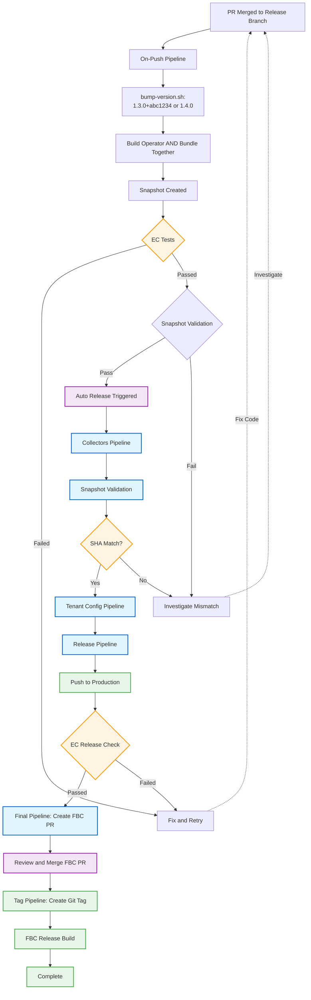
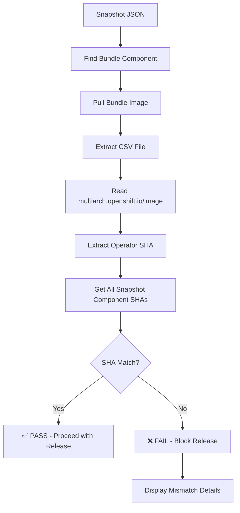

# Automated Konflux Release Workflow

This document describes the **automated release process** for the Multiarch Tuning Operator using Konflux CI/CD. This replaces the manual release process with automated pipelines that handle validation, release, and catalog updates.

> **Note**: For the previous manual release process (still useful for understanding release mechanics), see [docs/ocp-release.md](./ocp-release.md).

---

## Table of Contents

- [Overview](#overview)
- [Release Workflow Stages](#release-workflow-stages)
  - [1. Pre-Merge: Development and Configuration](#1-pre-merge-development-and-configuration)
  - [2. Automated Pipeline Execution: Build and Version Synchronization](#2-automated-pipeline-execution-build-and-version-synchronization)
  - [3. Auto Release Workflow](#3-auto-release-workflow)
- [Configuration](#configuration)
  - [ReleasePlan Configuration](#releaseplan-configuration)
  - [ReleasePlanAdmission Configuration](#releaseplanadmission-configuration)
- [Snapshot Validation](#snapshot-validation)
- [References](#references)

---

## Overview

The automated release workflow orchestrates the complete release lifecycle from code merge to catalog publication:



## Release Workflow Stages

### 1. Pre-Merge: Development and Configuration

**Version Bumping**

There are two types of versions:

1. **Clean Versions** (Official Releases): `1.4.0`, `1.4.1`, `2.0.0`
   - No commit suffix
   - Official GA/patch releases
   - Created by using `[clean-version]` in commit message
   - Must be first version for a new base (e.g., `1.4.0` comes before `1.4.0+abc1234`)
   - **Cannot be skipped** in upgrade paths (permanent milestones)

2. **Patch Versions** (Development Snapshots): `1.4.0+abc1234`, `1.4.0+def5678`
   - Have `+` and commit hash suffix
   - Continuous delivery builds
   - Created automatically for normal commits
   - Come AFTER clean version for same base
   - **Can be skipped** in upgrade paths

**Creating a Clean Version:**

Update `VERSION` in with `./hack/bump-verions-manual.sh`, then create commit with `[clean-version]` in the message:

```bash
git commit -m "Bump version to 1.4.0 [clean-version]"
```

The `[clean-version]` tag in the commit message tells the pipeline to generate version `1.4.0` instead of `1.4.0+abc1234`.

---

#### Pre-Merge Configuration (REQUIRED before creating the branching PR)

Before creating the release PR, you must update the Konflux release configuration in the konflux-release-data repository.

#### Update ReleasePlanAdmission in Konflux Release Data

**Location:** [GitLab - konflux-release-data](https://gitlab.cee.redhat.com/releng/konflux-release-data)

**File to update:** `config/stone-prd-rh01.pg1f.p1/product/ReleasePlanAdmission/multiarch-tuning-ope/multiarch-tuning-operator-<version>.yaml`

**Example:** For v1.x releases, edit `multiarch-tuning-operator-v1-x.yaml`

**Verify current configuration:**
```bash
# View the current ReleasePlanAdmission (deployed in rhtap-releng-tenant)
oc describe releasePlanAdmission multiarch-tuning-operator-v1-x -n rhtap-releng-tenant
```

**Steps:**

1. **Add new version to allowed tags:**
   ```yaml
   # multiarch-tuning-operator-v1-x.yaml
   spec:
     defaults:
       tags:
         - "1.0.0"
         - "1.0.0-{{ timestamp }}"
         - "1.0.1"              # ← ADD NEW VERSION
         - "1.0.1-{{ timestamp }}"  # ← ADD TIMESTAMPED VERSION
   ```

2. **Validate OCP version targets in FBC applications** (if applicable):
   ```yaml
   # multiarch-tuning-operator-fbc-prod-index.yaml
   spec:
     applications:
       - fbc-v4-17
       - fbc-v4-18
       - fbc-v4-19  # ← Verify all supported OCP versions are listed
   ```

3. **Update release notes template** (if needed):
   ```yaml
   data:
     releaseNotes:
       type: RHEA
       synopsis: "Red Hat Multiarch Tuning {{ version }}"
       description: |
         # Update with actual features/fixes for this release
         Enhancements:
         * Feature A
         
         Bug fixes:
         * Fix B
   ```
4 **Create Merge Request** in GitLab with changes

#### Verify ProjectDevelopmentStream Configuration

**Location:** [GitLab - konflux-release-data](https://gitlab.cee.redhat.com/releng/konflux-release-data)

**File:** `tenants-config/cluster/stone-prd-rh01/tenants/multiarch-tuning-ope-tenant/_base/projectl.konflux.dev/projectdevelopmentstreams/multiarch-tuning-operator-<version>/projectdevelopmentstream.yaml`

**Verify Update collectors fixVersion in template release section:**
   
   In the ProjectDevelopmentStream template, find the collectors JIRA query configuration and update the fixVersion:
   
   **Location in PDST YAML:** Look for the collectors parameters section
   
   ```yaml
   template:
     # ... other template configuration ...
     release:
       collectors:
         - name: url
           value: https://issues.redhat.com
         - name: query
           value: 'project = "MULTIARCH" AND fixVersion = "1#### Verify ProjectDevelopmentStream Configuration
.3" AND component = "Multiarch-Tuning-Operator"'
           # ↑ UPDATE THIS fixVersion to match your release
         - name: secretName
           value: jira-secret
   ```
   
   **Critical steps:**
   - Find the `fixVersion = "X.Y"` or `fixVersion = "X.Y.Z"` in the JIRA query string
   - Update it to match your target release version
   - Format can be either:
     - Minor version: `"1.3"` for all v1.3.x releases
     - Specific version: `"1.3.0"` for exact version targeting
   - This controls which JIRA tickets are collected for release notes
   - Wrong fixVersion will collect incorrect issues or fail to find release-related tickets
   
   **Examples:**
   - For v1.4.x stream: Change `fixVersion = "1.3"` to `fixVersion = "1.4"`
   - For specific v1.4.1 release: Change to `fixVersion = "1.4.1"`
   - For v2.0.0 release: Change to `fixVersion = "2.0.0"` or `fixVersion = "2.0"`

#### Update Comet Content Streams (Preparation)

**Location:** [Comet](https://comet.engineering.redhat.com/containers/repositories/6616582895a35187a06ba2ce)

**Action:** Prepare to add new tag to content streams (will be finalized after release)
- Make note of the new version tag: `v1.0.1`
- Content stream update happens after release pipeline completes
---

### 2. Automated Pipeline Execution: Synchronized Build

After preparing your release branch with the necessary changes, merge the PR to trigger the automated build and release process.

#### Overview: Automatic Version Generation

Versions are **generated automatically** during the build pipeline's `run-script` task in the format:
- **Clean version**: `1.4.0` (when `[clean-version]` in commit message)
- **Patch version**: `BASE_VERSION+COMMIT_SHA` (e.g., `1.4.0+abc1234`)

**Why dynamic versioning?** Each build needs a unique version tag for the OLM (Operator Lifecycle Manager) File-Based Catalog (FBC). The catalog uses these versions to build the upgrade graph and enable skip logic - allowing users to upgrade directly from older patch versions to the latest without installing intermediate releases. Without unique versions for each build, OLM cannot distinguish between different snapshots or construct proper upgrade paths.

**Why must FBC catalog and bundle CSV versions match?** The FBC upgrade graph references bundles by their version tag (e.g., `1.4.0+abc1234`), and the bundle's ClusterServiceVersion (CSV) must have the exact same version in its `.spec.version` field. When `operator-sdk` validates the catalog, it checks that the bundle's CSV version matches the version declared in the upgrade graph. If there's a mismatch (FBC says bundle is `multiarch-tuning-operator.v1.4.0+abc1234` but the bundle's CSV `.spec.version` is `1.4.0+def5678`), validation fails and the release cannot proceed. This is why the bundle must be built with the version that will be used in the FBC catalog entry.

**Why `+` separator (semver build metadata)?** According to [Semantic Versioning 2.0.0](https://semver.org/), the plus sign denotes build metadata (e.g., `1.4.0+abc1234`), while dash denotes pre-release versions (e.g., `1.4.0-alpha`). Patch versions are production builds with identifying metadata, not pre-releases.

---

#### Operator and Bundle Build Together

**Architecture:** The operator on-push pipeline is triggered via CEL expression whenever the bundle on-push runs:

**.tekton/multiarch-tuning-operator-push.yaml:**
```yaml
pipelinesascode.tekton.dev/on-cel-expression: |
  event == "push" && target_branch == "main" && 
  (".tekton/***".pathChanged() || 
   "api/***".pathChanged() || 
   "internal/***".pathChanged() || 
   "pkg/***".pathChanged() || 
   "test/***".pathChanged() || 
   "konflux.Dockerfile".pathChanged() || 
   "go.mod".pathChanged() || 
   "cmd/***".pathChanged() || 
   "go.sum".pathChanged() || 
   "bundle/***".pathChanged() ||           # ← Bundle changes trigger operator build
   "bundle.konflux.Dockerfile".pathChanged() ||
   "trigger-konflux-builds.txt".pathChanged())
```

This ensures operator and bundle always build together with matching versions.

---

**What happens when you merge a PR to the release branch:**

#### Build Pipeline Execution

When the PR merges to the release branch (e.g., `v1.x`):

1. **On-push pipelines triggered** - Konflux detects the merge and starts building **both** operator and bundle images

2. **Version generation via `run-script` task:**
   
   The pipeline runs the `run-script` task which executes `hack/bump-version.sh`:
   
   ```bash
   COMMIT_MSG=$(git log -1 --format=%s)
   
   # Check if this commit requests clean version
   if [[ "$COMMIT_MSG" =~ \[clean-version\] ]]; then
     VERSION=$(grep -E "^VERSION \?=" Makefile | awk '{print $3}')
     echo "Clean version requested: $VERSION"
     export VERSION
   else
     # Normal commit - generate patch version with commit suffix
     BASE_VERSION=$(grep -E "^VERSION \?=" Makefile | awk '{print $3}')
     COMMIT_SHA=$(tasks.clone-repository.results.commit)
     export VERSION="${BASE_VERSION}+${COMMIT_SHA:0:7}"
     echo "Generated patch version: $VERSION"
   fi
   
   exec ./hack/bump-version.sh
   ```
   
   - For `[clean-version]` commits: Version = `1.4.0`
   - For normal commits: Version = `1.4.0+abc1234`
   - Script updates all version references in CSV, Dockerfiles, Makefile
   - All subsequent build tasks use this versioned source

3. **Bundle built with correct operator reference:**
   - Bundle's `bundle.konflux.Dockerfile` uses `ARG IMG=` pointing to operator's registry path
   - The bundle build replaces image references in CSV with the operator image digest
   - Operator and bundle have **identical versions** (both `1.4.0+abc1234` or both `1.4.0`)

4. **Snapshot created:**
   - **Operator:** `quay.io/.../operator@sha256:abc1234` (version `1.4.0+abc1234`)
   - **Bundle:** `quay.io/.../bundle@sha256:xyz9876` (version `1.4.0+abc1234`, references operator@sha256:abc1234)
   - **Validation passes** ✓ - Operator and bundle versions match, bundle references correct operator digest
   - **This is the snapshot to release**

---

### 3. Auto Release Workflow

Once the snapshot passes Enterprise Contract validation, the ReleasePlan automatically triggers a series of release pipelines (executed in `rhtap-releng-tenant` namespace):

#### Stage 1: Collectors Pipeline
- **Purpose**: Gather metadata and prerequisites for release
- **What it does**:
  - Collects tenant configuration
  - Gathers Jira issues based on the query: `project = "MULTIARCH" AND fixVersion = "1.3" AND component = "Multiarch-Tuning-Operator"`
  - Populates release notes metadata in the Release CR
  
- **Release CR Status Structure:**
  ```yaml
  apiVersion: appstudio.redhat.com/v1alpha1
  kind: Release
  status:
    collectors:
      tenant:
        project-issues:
          releaseNotes:
            fixed:
            - id: "MULTIARCH-1234"
              source: "issues.redhat.com"
  ```

- **Outputs**: 
  - Collected Jira issues and metadata for release notes
  - This metadata gets added to the advisory at https://gitlab.cee.redhat.com/releng/advisories
  - Metadata for downstream pipelines
  
- **Pipeline**: Part of ReleasePlan pipeline chain

#### Stage 2:  Tenant Config Pipeline Snapshot Validation Pipeline (Pre-Release)
- **Purpose**: Verify operator image SHA in bundle matches snapshot
- **Pipeline**: `.tekton/snapshot-validation-pipeline.yaml`
- **What it checks**:
  - Extracts bundle image from snapshot components
  - Pulls and extracts bundle to read ClusterServiceVersion
  - Reads `multiarch.openshift.io/image` annotation from CSV deployment spec
  - Extracts SHA256 from operator image reference
  - Compares operator image SHA with all snapshot component SHAs
  - **Fails if**: Bundle references wrong operator image version
- **Critical**: This prevents releasing inconsistent bundles
  
See [Snapshot Validation](#snapshot-validation) for details.

#### Stage 3: Release Pipeline
- **Purpose**: Publish images and bundles to production registries
- **Pipeline**: `rh-push-to-registry` from release-service-catalog
- **What it does**:
  - Pushes operator image to production Quay registry
  - Pushes bundle image to production registry
  - Creates registry tags based on ReleasePlanAdmission configuration
  - Triggers IIB (Index Image Builder) for bundle integration
  - Generates release metadata
- **Outputs**:
  - Operator image: `registry.redhat.io/multiarch-tuning/multiarch-tuning-rhel9-operator:v1.0.1`
  - Bundle image: `registry.redhat.io/multiarch-tuning/multiarch-tuning-operator-bundle:v1.0.1`
  - Index image: `brew.registry.redhat.io/rh-osbs/iib:XXXXXX`
  - Release notes structure

#### Stage 4: Post-Release (Final) Pipeline
- **Purpose**: Automate FBC catalog updates and PR creation
- **Pipeline**: `.tekton/fbc-update-final-pipeline.yaml`
- **Triggered**: After images are successfully pushed to production registries
- **Authentication**: Uses GitHub App `mto-konflux-release-app` for credentials (custom pipeline requires self-managed auth)
- **What it does**:
  - Extracts version from released bundle
  - Updates FBC catalog with new bundle entry and skip logic
  - Creates automated PR to update FBC catalogs

**Pipeline Tasks:**

1. **extract-version-from-bundle** - Downloads bundle and extracts CSV version
   ```bash
   skopeo copy docker://<bundle-image> dir:/tmp/bundle
   yq eval '.spec.version' /tmp/bundle/manifests/*.clusterserviceversion.yaml
   # Output: 1.3.0-606dcba
   ```

2. **check-version-in-channel** - Skips update if version already exists in FBC channel graph

3. **build-indexes** - Appends bundle metadata to all OCP version catalogs
   - Script: `fbc` branch at `hack/build-indexes.sh`
   - Updates all `fbc-v4-*/catalog/multiarch-tuning-operator/index.yaml` files
   - Uses `opm render` to append bundle entry

4. **update-graph** - Updates channel graphs with version-aware skip logic:
   
   **Clean versions** (`1.4.0`) - released FIRST:
   ```yaml
   entries:
     - name: multiarch-tuning-operator.v1.4.0
       replaces: multiarch-tuning-operator.v1.3.0+ghi9012  # Previous version (clean or patch)
   ```
   
   **Patch versions** (`1.4.0+606dcba`) - come AFTER clean:
   ```yaml
   entries:
     - name: multiarch-tuning-operator.v1.4.0+ghi9012
       replaces: multiarch-tuning-operator.v1.4.0+def5678  # Previous patch
       skips:
         - multiarch-tuning-operator.v1.4.0+abc1234       # Older patches (NOT clean 1.4.0)
     - name: multiarch-tuning-operator.v1.4.0+def5678
       replaces: multiarch-tuning-operator.v1.4.0+abc1234
     - name: multiarch-tuning-operator.v1.4.0+abc1234
       replaces: multiarch-tuning-operator.v1.4.0          # First patch replaces clean
   ```

5. **push-and-create-pr** - Creates PR against `fbc` branch
   - Title: `chore: Update FBC catalogs for v1.3.0-606dcba`
   - Two commits: bundle metadata update + channel graph update

**FBC Branch Structure:**
```
fbc/
├── fbc-v4-17/catalog/multiarch-tuning-operator/index.yaml
├── fbc-v4-18/catalog/multiarch-tuning-operator/index.yaml
├── fbc-v4-19/catalog/multiarch-tuning-operator/index.yaml
└── hack/
    ├── build-indexes.sh   # Append bundle to all catalogs
    └── update-graph.sh    # Update channel graphs with skip logic
```

**Pipeline Output:**
```
VERSION: v1.3.0-606dcba
FBC_PR_URL: https://github.com/openshift/multiarch-tuning-operator/pull/123
```


---

#### Stage 5: FBC PR Merge and Release Finalization

**Manual Step: Review and Merge FBC PR**
- Review the automated FBC PR created by Stage 4
- Verify catalog changes and skip logic are correct
- Merge the PR to `fbc` branch

**Automatic: Tag Pipeline Triggered on FBC PR Merge**
- **Pipeline**: `.tekton/fbc-release-tag-pipeline.yaml` (on-push trigger for `fbc` branch)
- **What it does**:
  1. Extracts version from the merged FBC catalog changes
  2. Creates git tag on the **release branch** (e.g., `v1.x`) commit: `v1.3.0-606dcba`
  3. Pushes tag to GitHub (creates GitHub release)

**Automatic: FBC Release Build**
- **Triggered**: When git tag is pushed
- **Pipeline**: FBC image build pipeline
- **What it does**:
  1. Builds FBC catalog image with the updated channel graph
  2. Pushes to production registry: `registry.redhat.io/redhat/redhat-operator-index:v4.XX`
  3. Makes the new operator version available in OperatorHub

**Release Complete** - Operator version `1.3.0-606dcba` is now available for installation and upgrades via OLM

---

**Implementation Details:**
- FBC update pipeline uses pre-installed `jq` and `yq` from `appstudio-utils` image
- Downloads `opm` with fixed version (v1.48.0) for reproducibility
- Uses `awk` instead of `yq` for channel graph updates (avoids YAML stream formatting issues)
- Preserves file formatting - only appends/inserts content, never reformats existing files
- Script location: `fbc` branch at `hack/build-indexes.sh`

**Monitoring Commands:**
```bash
# Monitor FBC PR merge and tag pipeline
tkn pipelinerun list -n multiarch-tuning-ope-tenant | grep fbc

# Follow tag pipeline execution
tkn pipelinerun logs <tag-pipeline-name> -f -n multiarch-tuning-ope-tenant

# Verify git tag was created
git fetch --tags
git tag -l "v1.3.0-*"

# Check FBC snapshot after merge
oc get snapshots --sort-by .metadata.creationTimestamp \
  -l pac.test.appstudio.openshift.io/event-type=push,\
appstudio.openshift.io/application=fbc-v4-<version>

# Verify FBC release status
oc get release -n multiarch-tuning-ope-tenant | grep fbc
```


### Comprehensive Skip Logic with Clean and Patch Versions

The FBC channel graph skip logic distinguishes between **clean versions** (official releases) and **patch versions** (development snapshots) to create efficient upgrade paths.

#### Task Implementation Details

The operator build pipeline (`.tekton/single-arch-build-pipeline.yaml` and `.tekton/multi-arch-build-pipeline.yaml`) automatically handles version generation through the `run-script` task:

**Task: `run-script` (runs hack/bump-version.sh)**
- Reads commit message to detect `[clean-version]` tag
- Script generates version based on commit message:
  - Clean version: `1.4.0` (when `[clean-version]` present)
  - Patch version: `BASE_VERSION+COMMIT_SHA` (normal commits)
- Reads `BASE_VERSION` from `Makefile`
- Uses first 7 chars of `COMMIT_SHA` for patches
- Updates CSV `.spec.version`, Dockerfiles, and Makefile
- Manually updates bundle files (hermetic - no external tool downloads)
- **Output:** Modified source with version `1.4.0` or `1.4.0+abc1234`

**FBC Integration:**

The FBC update pipeline then:
1. Extracts version from the bundle's CSV using `yq` and `skopeo`
2. Uses the **exact same version** for FBC catalog updates
3. Detects clean versions (no `+`) vs patch versions (has `+COMMIT`)
4. Applies different skip logic based on version type

---


### Overview of FBC Upgrade Graph

**Version Release Pattern:**
1. **Clean version released FIRST** (e.g., `1.4.0`) - establishes the base
2. **Patch versions follow** (e.g., `1.4.0+abc1234`, `1.4.0+def5678`) - improvements on the base

**Important:**
- **Clean versions** (`1.4.0`, `1.4.1`): Official releases, cannot be skipped
- **Patch versions** (`1.4.0+abc1234`): Development snapshots, can be skipped
- **Old releases** (before this system): May not follow this pattern (e.g., `1.2.2`, `1.3.0`)

The skip logic determines whether to add `skips` entries based on version type and what already exists in the channel graph.

#### Scenario 1: Starting Fresh with v1.4.0

**Initial State:**
```yaml
entries:
  - name: multiarch-tuning-operator.v1.3.0
    replaces: multiarch-tuning-operator.v1.2.2
  - name: multiarch-tuning-operator.v1.2.2
    replaces: multiarch-tuning-operator.v1.2.1
```

---

### Release 1: `v1.4.0` (Clean version - establishes new base)

**Pipeline Logic:**
- Commit with `[clean-version]` in message
- Extract BASE_VERSION: `1.4.0` (no `+` suffix)
- Check: Does clean `1.4.0` exist? → **No**
- Decision: New base version, no skips

**Result:**
```yaml
entries:
  - name: multiarch-tuning-operator.v1.4.0
    replaces: multiarch-tuning-operator.v1.3.0  # replaces previous clean version
  - name: multiarch-tuning-operator.v1.3.0
    replaces: multiarch-tuning-operator.v1.2.2
```

**Upgrade Path:**
- `1.3.0` → `1.4.0` (automatic upgrade)

---

### Release 2: `v1.4.0+abc1234` (First patch for 1.4.0)

**Pipeline Logic:**
- Normal commit (no `[clean-version]` tag)
- Extract BASE_VERSION: `1.4.0`, patch: `+abc1234`
- Check: Does clean `1.4.0` exist? → **Yes**
- Check: Do other patches exist? → **No**
- Decision: First patch, replaces clean version, no skips

**Result:**
```yaml
entries:
  - name: multiarch-tuning-operator.v1.4.0+abc1234
    replaces: multiarch-tuning-operator.v1.4.0  # replaces clean version
  - name: multiarch-tuning-operator.v1.4.0
    replaces: multiarch-tuning-operator.v1.3.0
```

**Upgrade Paths:**
- `1.4.0` → `1.4.0+abc1234` (automatic upgrade from clean to first patch)

---

### Release 3: `v1.4.0+def5678` (Second patch for 1.4.0)

**Pipeline Logic:**
- Normal commit
- Extract BASE_VERSION: `1.4.0`, patch: `+def5678`
- Check: Does clean `1.4.0` exist? → **Yes**
- Check: Do other patches exist? → **Yes** (`+abc1234`)
- Find skip versions: `1.4.0+abc1234` (don't include clean `1.4.0` - it's a milestone)

**Result:**
```yaml
entries:
  - name: multiarch-tuning-operator.v1.4.0+def5678
    replaces: multiarch-tuning-operator.v1.4.0+abc1234  # replaces previous patch
    skips:
      - (none - only one previous patch, which we're replacing)
  - name: multiarch-tuning-operator.v1.4.0+abc1234
    replaces: multiarch-tuning-operator.v1.4.0
  - name: multiarch-tuning-operator.v1.4.0
    replaces: multiarch-tuning-operator.v1.3.0
```

**Upgrade Paths:**
- `1.4.0+abc1234` → `1.4.0+def5678` (automatic upgrade)
- `1.4.0` → auto to `+abc1234` → auto to `+def5678`

---

### Release 4: `v1.4.0+ghi9012` (Third patch for 1.4.0)

**Pipeline Logic:**
- Extract BASE_VERSION: `1.4.0`, patch: `+ghi9012`
- Find patches: `1.4.0+abc1234`, `1.4.0+def5678`
- Replaces: Most recent patch (`+def5678`)
- Skips: Older patches except the one we're replacing (`+abc1234`)

**Result:**
```yaml
entries:
  - name: multiarch-tuning-operator.v1.4.0+ghi9012
    replaces: multiarch-tuning-operator.v1.4.0+def5678  # replaces latest patch
    skips:
      - multiarch-tuning-operator.v1.4.0+abc1234       # can skip older patch
  - name: multiarch-tuning-operator.v1.4.0+def5678
    replaces: multiarch-tuning-operator.v1.4.0+abc1234
  - name: multiarch-tuning-operator.v1.4.0+abc1234
    replaces: multiarch-tuning-operator.v1.4.0
  - name: multiarch-tuning-operator.v1.4.0
    replaces: multiarch-tuning-operator.v1.3.0
```

**Upgrade Paths:**
- **Automatic:** `1.4.0` → `+abc` → `+def` → `+ghi` (full chain)
- **Automatic:** `1.4.0+def5678` → `1.4.0+ghi9012` (from previous patch)
- **Manual skip:** User on `1.4.0+abc1234` can manually select `1.4.0+ghi9012` (skips `+def5678`)

---

### Release 5: `v1.4.1` (Clean version - new minor release)

**Pipeline Logic:**
- Commit with `[clean-version]`, Makefile updated to `1.4.1`
- Extract BASE_VERSION: `1.4.1` (no `+` suffix)
- Check: Does clean `1.4.1` exist? → **No**
- Decision: New base version, replaces latest from previous base

**Result:**
```yaml
entries:
  - name: multiarch-tuning-operator.v1.4.1
    replaces: multiarch-tuning-operator.v1.4.0+ghi9012  # replaces latest from 1.4.0
  - name: multiarch-tuning-operator.v1.4.0+ghi9012
    replaces: multiarch-tuning-operator.v1.4.0+def5678
    skips: [...]
  - name: multiarch-tuning-operator.v1.4.0
    replaces: multiarch-tuning-operator.v1.3.0
```

**Upgrade Path:**
- `1.4.0+ghi9012` → `1.4.1` (automatic upgrade to new minor version)

---

### Release 6: `v1.4.1+abc1234` (First patch for 1.4.1)

**Pipeline Logic:**
- Normal commit
- Extract BASE_VERSION: `1.4.1`, patch: `+abc1234`
- Check: Does clean `1.4.1` exist? → **Yes**
- Check: Do other patches exist? → **No**
- Decision: First patch, replaces clean version

**Result:**
```yaml
entries:
  - name: multiarch-tuning-operator.v1.4.1+abc1234
    replaces: multiarch-tuning-operator.v1.4.1  # replaces clean version
  - name: multiarch-tuning-operator.v1.4.1
    replaces: multiarch-tuning-operator.v1.4.0+ghi9012
  - name: multiarch-tuning-operator.v1.4.0+ghi9012
    replaces: multiarch-tuning-operator.v1.4.0+def5678
    skips: [...]
```

**Upgrade Paths:**
- `1.4.1` → `1.4.1+abc1234` (automatic upgrade)
- `1.4.0+ghi9012` → auto to `1.4.1` → auto to `1.4.1+abc1234`

---

### Release 7: `v1.4.1+def5678` (Second patch for 1.4.1)

**Pipeline Logic:**
- Extract BASE_VERSION: `1.4.1`, patch: `+def5678`
- Find patches: `1.4.1+abc1234`
- Replaces: Previous patch (`+abc1234`)
- Skips: (none - only one previous patch, which we're replacing)

**Result:**
```yaml
entries:
  - name: multiarch-tuning-operator.v1.4.1+def5678
    replaces: multiarch-tuning-operator.v1.4.1+abc1234
  - name: multiarch-tuning-operator.v1.4.1+abc1234
    replaces: multiarch-tuning-operator.v1.4.1
  - name: multiarch-tuning-operator.v1.4.1
    replaces: multiarch-tuning-operator.v1.4.0+ghi9012
```

**Upgrade Paths:**
- `1.4.1+abc1234` → `1.4.1+def5678` (automatic upgrade)
- `1.4.1` → auto to `+abc` → auto to `+def`

---

### Release 8: `v1.4.1+ghi9012` (Third patch for 1.4.1)

**Pipeline Logic:**
- Find patches: `1.4.1+abc1234`, `1.4.1+def5678`
- Replaces: Latest patch (`+def5678`)
- Skips: Older patch (`+abc1234`)

**Result:**
```yaml
entries:
  - name: multiarch-tuning-operator.v1.4.1+ghi9012
    replaces: multiarch-tuning-operator.v1.4.1+def5678
    skips:
      - multiarch-tuning-operator.v1.4.1+abc1234
  - name: multiarch-tuning-operator.v1.4.1+def5678
    replaces: multiarch-tuning-operator.v1.4.1+abc1234
  - name: multiarch-tuning-operator.v1.4.1+abc1234
    replaces: multiarch-tuning-operator.v1.4.1
  - name: multiarch-tuning-operator.v1.4.1
    replaces: multiarch-tuning-operator.v1.4.0+ghi9012
```

**Upgrade Paths:**
- **Automatic:** `1.4.1+def5678` → `1.4.1+ghi9012`
- **Manual skip:** User on `1.4.1+abc1234` can select `1.4.1+ghi9012` (skips `+def5678`)

---

#### Summary of Logic

| Scenario | Version Type | Clean Exists? | Patches Exist? | Action | Replaces | Skips | Example |
|----------|--------------|---------------|----------------|--------|----------|-------|---------|
| **New clean version** | Clean (`1.4.0`) | No | N/A | New base | Latest from previous base | None | `1.4.0` → replaces `1.3.0+xyz` |
| **First patch** | Patch (`1.4.0+abc`) | Yes | No | First patch | Clean version of same base | None | `1.4.0+abc` → replaces `1.4.0` |
| **Second patch** | Patch (`1.4.0+def`) | Yes | Yes | Subsequent patch | Previous patch | None* | `1.4.0+def` → replaces `1.4.0+abc` |
| **Third+ patch** | Patch (`1.4.0+ghi`) | Yes | Yes (2+) | Subsequent patch | Latest patch | Older patches** | `1.4.0+ghi` → replaces `1.4.0+def`, skips `[1.4.0+abc]` |
| **Clean after patches*** | Clean (`1.4.0`) | No | Yes | ERROR | N/A | N/A | Cannot add clean after patches |

\* Second patch has only one previous patch (which it replaces), so skips list is empty
\** Skips all patches except the one being replaced and the clean version (milestone)
\*** This scenario is blocked - clean versions must come FIRST

---

#### Pipeline Implementation

##### Key Code Logic

```bash
# Extract base version from VERSION_NO_V (e.g., "1.4.0" from "1.4.0+606dcba")
if [[ "$VERSION_NO_V" =~ ^([0-9]+\.[0-9]+\.[0-9]+)\+(.+)$ ]]; then
    BASE_VERSION="${BASH_REMATCH[1]}"
    COMMIT_SUFFIX="${BASH_REMATCH[2]}"
    IS_CLEAN_VERSION=false
    echo "Patch version: $VERSION_NO_V"
else
    # Clean version (no + suffix)
    BASE_VERSION="$VERSION_NO_V"
    COMMIT_SUFFIX=""
    IS_CLEAN_VERSION=true
    echo "Clean version: $BASE_VERSION"
fi

# Check what exists for this base version
CLEAN_VERSION_EXISTS=false
PATCH_VERSIONS_EXIST=false
for check_file in fbc-v*/catalog/multiarch-tuning-operator/index.yaml; do
    # Check for clean version (exact match)
    if grep -q "name: multiarch-tuning-operator.v${BASE_VERSION}\$" "$check_file"; then
        CLEAN_VERSION_EXISTS=true
    fi
    # Check for patch versions (with +)
    if grep -q "name: multiarch-tuning-operator.v${BASE_VERSION}+" "$check_file"; then
        PATCH_VERSIONS_EXIST=true
    fi
done

# Determine strategy based on version type and what exists
if [ "$IS_CLEAN_VERSION" = true ]; then
    if [ "$CLEAN_VERSION_EXISTS" = true ]; then
        echo "ERROR: Clean version $BASE_VERSION already exists"
        exit 1
    fi
    # New clean version - no skips
    USE_SKIPS=false
else
    if [ "$CLEAN_VERSION_EXISTS" = false ]; then
        echo "ERROR: Clean version $BASE_VERSION must be released before patches"
        exit 1
    fi
    if [ "$PATCH_VERSIONS_EXIST" = true ]; then
        USE_SKIPS=true  # Add skips for previous patches
    else
        USE_SKIPS=false  # First patch, no skips
    fi
fi

# If USE_SKIPS=true, find all previous X.Y.Z+* patch versions (NOT clean version)
if [ "$USE_SKIPS" = true ]; then
    ALL_PATCHES=$(grep "name: multiarch-tuning-operator.v${BASE_VERSION}+" "$index_file" | \
        sed 's/.*name: //' | sed 's/^[[:space:]]*//' | \
        grep -v "^${ENTRY_NAME}$" || true)
    
    # Replaces: latest patch (first in file)
    REPLACES_TARGET=$(echo "$ALL_PATCHES" | head -1)
    
    # Skips: all patches except the one we're replacing
    SKIP_VERSIONS=$(echo "$ALL_PATCHES" | tail -n +2 || true)
fi
```


#### Skip Logic References

- Pipeline: `.tekton/fbc-update-final-pipeline.yaml`
- Script: `hack/bump-version.sh` (automatic versioning)
- Script: `hack/bump-version-manual.sh` (manual clean versions)

---

---

## Configuration

### ReleasePlan Configuration

#### Operator ReleasePlan

The ReleasePlan for the operator defines the automated release behavior:

```yaml
apiVersion: appstudio.redhat.com/v1alpha1
kind: ReleasePlan
metadata:
  name: multiarch-tuning-operator-1-0-release-as-operator
  namespace: multiarch-tuning-ope-tenant
spec:
  application: multiarch-tuning-operator-1-0
  target: multiarch-tuning-ope-prod
  
  # Collectors - gather JIRA issues for release notes
  data:
    collectors:
      - name: url
        value: https://issues.redhat.com
      - name: query
        value: 'project = "MULTIARCH" AND fixVersion = "mto-1.3" AND component = "Multiarch-Tuning-Operator"'
      - name: secretName
        value: jira-token
    fixVersion: "1.0"  # Must match the release version
  
  # Pre-release validation pipeline
  pipeline:
    pipelineRef:
      resolver: git
      params:
        - name: url
          value: https://github.com/openshift/multiarch-tuning-operator.git
        - name: revision
          value: main
        - name: pathInRepo
          value: .tekton/snapshot-validation-pipeline.yaml
    serviceAccountName: release-service-account
    timeout: "30m"
  
  # Post-release automation (git tag + FBC PR)
  finalPipeline:
    pipelineRef:
      resolver: git
      params:
        - name: url
          value: https://github.com/openshift/multiarch-tuning-operator.git
        - name: revision
          value: main
        - name: pathInRepo
          value: .tekton/fbc-update-final-pipeline.yaml
    params:
      - name: fbc-branch
        value: fbc
      - name: git-url
        value: https://github.com/openshift/multiarch-tuning-operator
    serviceAccountName: release-service-account
    timeout: "1h"
```

**Important fields to update for each release:**
- `data.fixVersion`: Set to match the release version (e.g., `"1.0"` for v1.0.x releases or `"1.0.1"` for specific release)
- This ensures the collectors query picks up the correct JIRA tickets

#### FBC ReleasePlan

The ReleasePlan for File-Based Catalog releases includes a final pipeline that tags the FBC commit:

```yaml
apiVersion: appstudio.redhat.com/v1alpha1
kind: ReleasePlan
metadata:
  name: fbc-4-18-release-as-fbc
  namespace: multiarch-tuning-ope-tenant
spec:
  application: fbc-v4-18
  target: multiarch-tuning-ope-prod
  
  # FBC has no pre-release validation pipeline (catalog validation done during build)
  
  # Post-release automation (tag the FBC commit in GitHub)
  finalPipeline:
    pipelineRef:
      resolver: git
      params:
        - name: url
          value: https://github.com/openshift/multiarch-tuning-operator.git
        - name: revision
          value: main
        - name: pathInRepo
          value: .tekton/fbc-tag-final-pipeline.yaml
    params:
      - name: git-url
        value: https://github.com/openshift/multiarch-tuning-operator
      - name: git-branch
        value: fbc
    serviceAccountName: release-service-account
    timeout: "30m"
```   

### ReleasePlanAdmission Configuration

Location: `konflux-release-data/config/stone-prd-rh01.pg1f.p1/product/ReleasePlanAdmission/multiarch-tuning-ope/`

```yaml
aapiVersion: appstudio.redhat.com/v1alpha1
kind: ReleasePlanAdmission
metadata:
  labels:
    release.appstudio.openshift.io/block-releases: "false"
    pp.engineering.redhat.com/business-unit: hybrid-platforms
  name: multiarch-tuning-operator-v1-x
  namespace: rhtap-releng-tenant
spec:
  applications:
    - multiarch-tuning-operator-v1-x
  origin: multiarch-tuning-ope-tenant
  policy: registry-multiarch-tuning-ope
  data:
    mapping:
      components:
        - name: multiarch-tuning-operator-v1-x
          repositories:
            - url: registry.redhat.io/multiarch-tuning/multiarch-tuning-rhel9-operator
        - name: multiarch-tuning-operator-bundle-v1-x
          repositories:
            - url: registry.redhat.io/multiarch-tuning/multiarch-tuning-operator-bundle
      defaults:
    tags:
      - "1.0.2"  # Add new versions here
      - "1.0.2-{{ timestamp }}"
  
  # Release notes template
  data:
    releaseNotes:
      type: RHEA
      synopsis: "Red Hat Multiarch Tuning {{ version }}"
      # ... (see example in ocp-release.md)
  
  # Pipeline references
  pipeline:
    pipelineRef:
      resolver: git
      params:
        - name: url
          value: https://github.com/redhat-appstudio/release-service-catalog.git
        - name: revision
          value: production
        - name: pathInRepo
          value: pipelines/rh-push-to-registry/rh-push-to-registry.yaml
    serviceAccountName: release-service-account
```

## Snapshot Validation

### Purpose

Prevents releasing inconsistent bundles where the bundle's CSV references an operator image not included in the snapshot.

Since operator and bundle now build together with matching versions, validation should pass on the first snapshot. If validation fails, it indicates a real problem that needs investigation.

### How It Works

1. **Extract bundle** from snapshot components
2. **Pull bundle image** and extract CSV
3. **Read annotation** `multiarch.openshift.io/image` from CSV deployment spec
4. **Extract SHA256** from the operator image reference
5. **Compare** with all component image SHAs in snapshot
6. **Pass/Fail** based on match

### Validation Flow



## References

### Documentation

- [Manual Release Process](./ocp-release.md) - Original manual steps, useful for understanding mechanics
- [Snapshot Validation](./snapshot-validation.md) - Detailed validation pipeline documentation
- [FBC Release Automation](./fbc-release-automation.md) - FBC automation implementation details

### External Resources

- [Konflux Documentation](https://konflux-ci.dev/docs/)
- [Konflux Release Guide](https://konflux-ci.dev/docs/advanced-how-tos/releasing/)
- [OLM File-Based Catalogs](https://olm.operatorframework.io/docs/reference/file-based-catalogs/)
- [Operator Package Manager](https://github.com/operator-framework/operator-registry)

### Internal Resources

- [Konflux Release Data GitLab](https://gitlab.cee.redhat.com/releng/konflux-release-data)
- [Release Epic Template](https://spaces.redhat.com/spaces/ENTMQMAAS/pages/151038604/Creating+a+new+micro+Z-stream+release)
- [Comet Container Registry](https://comet.engineering.redhat.com/containers/repositories/6616582895a35187a06ba2ce)

### Related Scripts

- `hack/bump-version.sh` - Version bumping automation
- `hack/check-snapshots.sh` - Manual snapshot validation
- `hack/build-indexs.sh` - FBC catalog bundle appending
- `hack/update-graph.sh` - FBC channel graph updates

