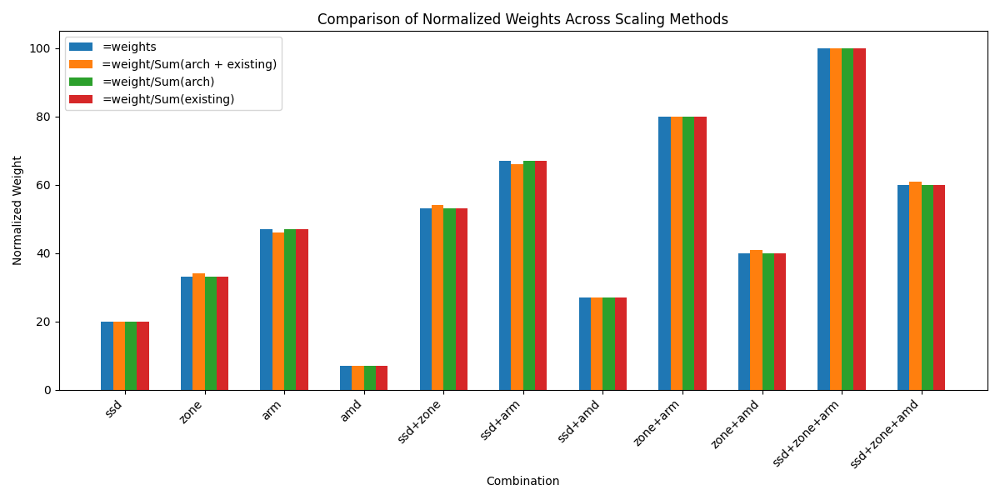
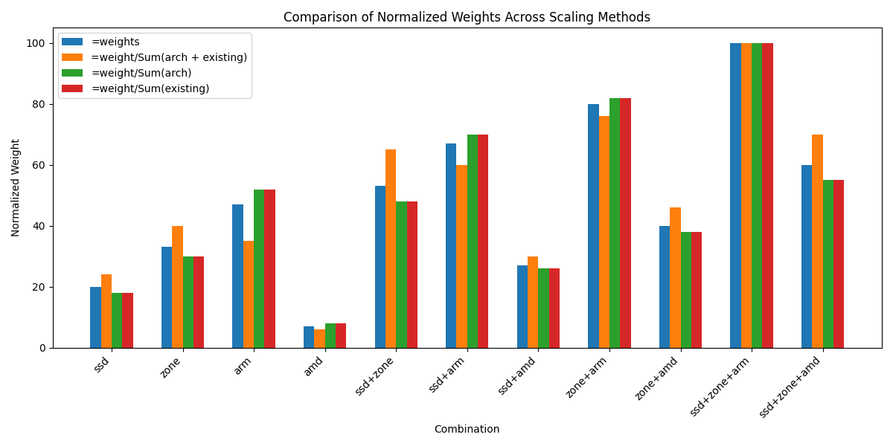
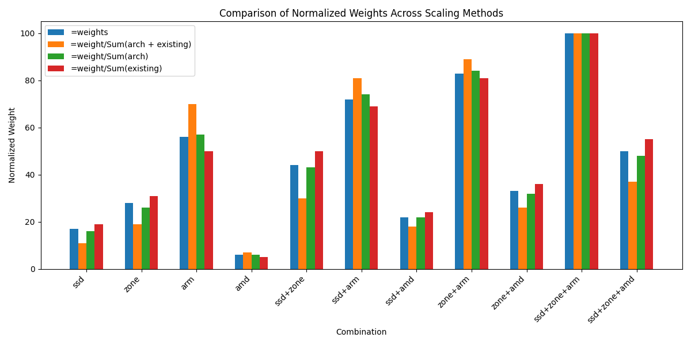

# Considerations for Cluster-wide Weights

To implement cluster-wide weights, we will use the `pod.Spec.Affinity.NodeAffinity.PreferredDuringSchedulingIgnoredDuringExecution` field.
The data structure are as follows:

```go
PreferredDuringSchedulingIgnoredDuringExecution []PreferredSchedulingTerm `json:"preferredDuringSchedulingIgnoredDuringExecution,omitempty" protobuf:"bytes,2,rep,name=preferredDuringSchedulingIgnoredDuringExecution"`

// An empty preferred scheduling term matches all objects with implicit weight 0
// (i.e. it's a no-op). A null preferred scheduling term matches no objects (i.e. is also a no-op).
type PreferredSchedulingTerm struct {
    // Weight associated with matching the corresponding nodeSelectorTerm, in the range 1-100.
    Weight int32 `json:"weight" protobuf:"varint,1,opt,name=weight"`
    // A node selector term, associated with the corresponding weight.
    Preference NodeSelectorTerm `json:"preference" protobuf:"bytes,2,opt,name=preference"`
}
````
```go
// A null or empty node selector term matches no objects. The requirements of
// them are ANDed.
// The TopologySelectorTerm type implements a subset of the NodeSelectorTerm.
// +structType=atomic
type NodeSelectorTerm struct {
    // A list of node selector requirements by node's labels.
    // +optional
    // +listType=atomic
    MatchExpressions []NodeSelectorRequirement `json:"matchExpressions,omitempty" protobuf:"bytes,1,rep,name=matchExpressions"`
    // A list of node selector requirements by node's fields.
    // +optional
    // +listType=atomic
    MatchFields []NodeSelectorRequirement `json:"matchFields,omitempty" protobuf:"bytes,2,rep,name=matchFields"`
}
````
```go
// A node selector requirement is a selector that contains values, a key, and an operator
// that relates the key and values.
type NodeSelectorRequirement struct {
    // The label key that the selector applies to.
    Key string `json:"key" protobuf:"bytes,1,opt,name=key"`
    // Represents a key's relationship to a set of values.
    // Valid operators are In, NotIn, Exists, DoesNotExist. Gt, and Lt.
    Operator NodeSelectorOperator `json:"operator" protobuf:"bytes,2,opt,name=operator,casttype=NodeSelectorOperator"`
    // An array of string values. If the operator is In or NotIn,
    // the values array must be non-empty. If the operator is Exists or DoesNotExist,
    // the values array must be empty. If the operator is Gt or Lt, the values
    // array must have a single element, which will be interpreted as an integer.
    // This array is replaced during a strategic merge patch.
    // +optional
    // +listType=atomic
    Values []string `json:"values,omitempty" protobuf:"bytes,3,rep,name=values"`
}

```
## Merging Methodology
### Append
In append mode, we concatenate the list of preferred affinity terms in the Cluster Pod Placement Configuration (CPPC) with those in the Pod we are reconciling. This approach allows users to freely set weights in their pods and CPPC according to their preference.

### Cartesian Product and Normalize
To use the Cartesian product, we must also adjust the weights to ensure balance with the newly added terms.

The steps are:
1. Combine the two sets using the Cartesian product.
2. Append the CPPC preferences as they are.

By using the Cartesian product, we scale the preference for a given term to `N` preferences weighted by both the architecture preference and the existing weight.
For example, if the architecture preferences are `{(25, arm64), (75, amd64)}`, and a pod expresses a preference for nodes labeled `disktype=ssd` with weight 1, the preference will be scaled as follows:

1. `disktype==ssd` + `amd64`
2. `disktype==ssd` + `arm64`
3. `amd64` (includes cases where no `disktype` label is present)
4. `arm64` (includes cases where no `disktype` label is present)

This ensures that:
- The previously set preferred affinity term is safe to modify, as architecture labels are always available.
- Nodes that lack specific labels in the pod’s preferred affinity terms are still scored based on architecture labels.

The issue with this approach is that it can disrupt the existing weight distribution in certain scenarios.

For example, the **Cartesian Merging Strategy** produces:
```yaml
PodPreferredAffinityTerms_new = {
  (31, {amd64, ssd}),
  (77, {arm64, ssd}),
  (22, {amd64}),
  (68, {arm64})
}
```
If there are no available `arm64` nodes, the scheduler will heavily favor the `{amd64, ssd}` rule, likely deprioritizing any other architectures that also have `ssd`. This imbalance could lead to unintended scheduling preferences.
if we do not have any `arm64` nodes then we are strongly prefering the amd `ssd` rule and will most likly ignore any other arch that has ssd

Additionally, a pod requesting `{ssd, arm64}` will be disproportionately skewed because it matches both high-weight rules, further tilting the scheduling balance.


## **Normalization Formula**
In cases where predefined `PreferredSchedulingTerms` exist, we must examine weather or not to preserve user-defined weights while incorporating architecture weights without unbalancing them.
We could achieve this using the using normalization:
However we must be careful as the weights in [PreferredDuringSchedulingIgnoredDuringExecution](https://github.com/openshift/kubernetes/blob/4683c1b0f6cd62add9fa3469c58fce1b971f48b6/pkg/scheduler/framework/plugins/helper/normalize_score.go#L27) are already normalized.
Here are three normalizations options. We could try applying these formulas to all the weights or just the existing weighs or just the arch weighs.

1. $$
new\_weight = 100 \times \frac{old\_weight}{\sum(arch\_weights)}
$$
2. $$
new\_weight = 100 \times \frac{old\_weight}{\sum(existing\_weights)}
$$
3. $$
new\_weight = 100 \times \frac{old\_weight}{\sum(all\_weights)}
$$

```yaml
PodPreferredAffinityTerms_new = {
  (30, {ssd}),
  (50, {zone}),
  (10, {amd64}),
  (70, {arm64})
}
```

   

   

   


### Scale Factors 

### Probabilistic scaling

## **Final Thoughts**
Since both strategies lead to similar prioritization, we must evaluate whether normalization is necessary or if simple concatenation suffices. Further analysis is needed to determine if normalization provides a tangible benefit or if it unnecessarily complicates the scheduling logic.

## Summary
- **Append Mode**: Simply appends terms, giving users full control over weights.
- **Cartesian Product & Normalize Mode**: Adjusts weights based on architecture preferences and existing weights, ensuring balanced scheduling.
- **Next Steps**: Assess whether normalization is necessary or if appending alone meets scheduling needs effectively.

