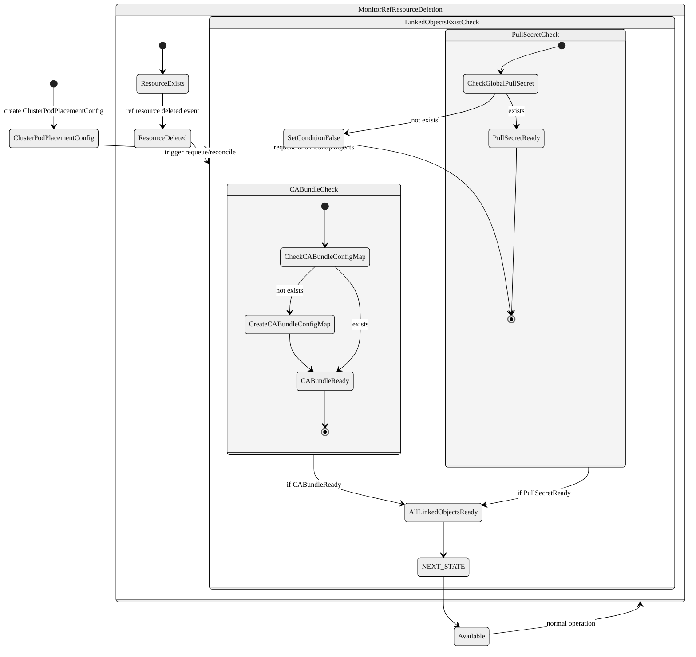

# Supporting Multiarch Tuning Operator on non-OCP clusters

## Summary
Currently, several versions of the Multiarch Tuning Operator (MTO) have been successfully released on 
the OpenShift Container Platform (OCP). To expand its applicability beyond OCP, we plan to make the operator compatible 
with upstream Kubernetes clusters.
Since the operator already supports deployment on CRI-O-based platforms like OCP, enabling it to run on 
non-OCP Kubernetes clusters that use CRI-O would be a logical and valuable first step.

## OpenShift-Specific Dependencies
To run the Multiarch Tuning Operator on other Kubernetes clusters, several OpenShift-specific dependencies need to be addressed:
- (a) `Global Pull Secret` – used to authenticate against image registries. In OpenShift, the global pull secret 
is stored as a `secret` named `pull-secret` in the `openshift-config` namespace and is configured 
by the cluster administrator. The Multiarch Tuning Operator watches this secret and uses it to authenticate 
when inspecting registry images.
- (b) `Global CA Bundle` – used to validate the TLS certificates of image registries during secure connections.
In OpenShift, resources labeled with `config.openshift.io/inject-trusted-cabundle: "true"` are automatically injected with the cluster’s trusted CA bundle. The Multiarch Tuning Operator uses a `ConfigMap` named `trusted-ca`, which is labeled accordingly to receive the injected bundle.
- (c) TLS Certificates – used to secure communication for the Multiarch Tuning Operator. In OpenShift, resources labeled 
with `service.beta.openshift.io/inject-cabundle: "true"` are automatically injected with the cluster’s CA bundle, 
enabling clients to verify TLS certificates issued within the cluster.
- (d) Registry Configuration - The image inspector uses default paths for registry-related configuration files such as `/etc/containers/registries.conf` and `/etc/containers/policy.json`. However, the location of these files may vary across different systems or distributions.
These resources are not automatically available in non-OCP clusters, and we should not expect users to manually create 
OpenShift-specific resources before installing the operator.

In [MULTIARCH-5324](https://issues.redhat.com/browse/MULTIARCH-5324), we propose introducing two fields in the ClusterPodPlacementConfig CRD: 
- (a) `GlobalPullSecretRef` - Allows users to reference their own pull secret, enabling the controller to inspect container images.
- (b) `CABundleConfigmapRef` - Allows users to reference a ConfigMap containing the CA bundle to verify registry TLS certificates. 
If not set, the operator will attempt to read CA certificates from cluster nodes and generate a default bundle automatically.
- (c) TLS Certificate Management – Automatically create and inject TLS certificates for the operator services, 
controller, and Webhook Configuration in non-OCP clusters.
- (d) Registry Configuration - Remove the hardcoded dependency on `/etc/containers/registries.conf` and `/etc/containers/policy.json`
- (e) Test Adjustments – Skip e2e test cases that rely on OpenShift-specific resources (e.g., `Build`, `DeploymentConfig`, or
`image.config.openshift.io`) when running in non-OCP clusters.

## Motivation
- Supporting Kubernetes outside of OCP will make the Multiarch Tuning Operator more accessible and usable in diverse environments.

### User Stories
- As a cluster administrator, I want to install and use the Multiarch Tuning Operator on a standard Kubernetes cluster without requiring OpenShift-specific dependencies.

### Goals
- Provide a way for users to install and use the Multiarch Tuning Operator on their non-OCP Kubernetes clusters.

### Non-Goals
- The global pull secret must be provided by the user; the operator will not automatically create it for non-OCP Kubernetes clusters.
- When the `CABundleConfigmapRef` field is not set, the operator will attempt to generate a default CA bundle. However, it does not guarantee that this bundle will be able to verify all registry TLS certificates.

## Proposal
We aim to make the operator compatible with standard Kubernetes clusters.

Its development is expected to ship in the following phases:
- Phase 1: Support for CRI-O Runtime-Based Kubernetes Clusters
  - Automatically generate TLS certificates for the required services and webhook configurations.  We may consider depending on `cert-manager` for non-OCP **deployments**.
  - Provide a mechanism for users to reference their own global pull secrets.
  - Provide a mechanism for users to reference their own CA bundles.
  - Remove the hardcoded dependency on registry configuration file paths.
  - Skip e2e test cases related to OpenShift-specific resources such as `Build`, `DeploymentConfig`, and `image.config.openshift.io` on non-OCP Kubernetes clusters.
- Phase 2: Adding Containerd and Docker Support
  - Extend support beyond `CRI-O` to include more runtime environments e.g. `containerd` and `Docker`.
  - Implement additional validation and compatibility checks.
  - Ensure consistent behavior across different container runtimes.

### Phase 1

#### Global pull secret for inspecting the images
Regarding pull secret handling, we propose adding a `GlobalPullSecretRef` field in the `ClusterPodPlacementConfig` CRD for non-OCP clusters.
Default values will be set as follows:
For OCP clusters: `openshift-config/pull-secret`
For non-OCP clusters: `operator-namespace/pull-secret`
The operator will read this reference and use the specified pull secret globally. If the secret does not exist, the controller will update the resource condition accordingly to indicate a `degraded` state.

#### CA bundle to verify registry certification
Regarding CA Bundle handling, we propose adding a `CABundleConfigmapRef` field in the ClusterPodPlacementConfig CRD. 
This allows non-OCP users to reference a ConfigMap that contains the CA bundle used to verify registry TLS certificates.
Users need to create this ConfigMap in the namespace where the operator will be installed.
If this field is not specified, the operator will attempt to retrieve the CA bundle from the cluster nodes and 
automatically generate a default ConfigMap.

#### TLS Certificate for the operator, the controllers and the webhook configuration
For non-OCP clusters, we will implement a mechanism to generate and manage certificates for the following services
  - `multiarch-tuning-operator-controller-manager-service-cert`
  - `pod-placement-controller`
  - `pod-placement-web-hook`

and webhook configurations.

We are currently evaluating two options:
- Option 1: Follow the official Kubernetes documentation [Manage TLS Certificates in a Cluster](https://kubernetes.io/docs/tasks/tls/managing-tls-in-a-cluster/) to implement certificate generation and rotation using native Kubernetes mechanisms.
- Option 2: Rely on an external `cert-manager` operator to automate the issuance and renewal of certificates.

We prefer **Option 2**, as it simplifies certificate lifecycle management and is widely adopted in Kubernetes environments.

#### Remove the Hardcoded Dependency on Registry Configuration Files
Remove hardcoded registry configuration paths and make them configurable or auto-detected at runtime to support non-OpenShift deployments.

#### Add Validation for Newly Added Fields
For OpenShift clusters, users should not be allowed to configure the two newly added fields. Validation logic will be added in [clusterpodplacementconfig_webhook.go](https://github.com/openshift/multiarch-tuning-operator/blob/main/apis/multiarch/v1beta1/clusterpodplacementconfig_webhook.go) to restrict users from setting or modifying these fields when the operator is running on an OpenShift cluster.
For non-OpenShift clusters, specifying a reference to the global pull secret in the `ClusterPodPlacementConfig` custom resource will be mandatory. This requirement will also be validated through logic implemented in the same webhook.

#### ClusterPodPlacementConfig CR

```go
type ClusterPodPlacementConfigSpec struct {
  // CABundleConfigmapRef is a reference to the ConfigMap containing the CA bundle
  // used to verify registry TLS certificates.
  // +optional
  CABundleConfigmapRef *corev1.LocalObjectReference `json:"caBundleConfigmapRef,omitempty"`
  // GlobalPullSecretRef is a reference to the Secret used for authenticating image registry pulls.
  // +optional
  GlobalPullSecretRef *corev1.SecretReference `json:"globalPullSecretRef,omitempty"`
}
```

```yaml
apiVersion: multiarch.openshift.io/v1beta1
kind: ClusterPodPlacementConfig
metadata:
  name: cluster
spec:
...
  caBundleConfigmapRef:
    name: trusted-ca
  globalPullSecretRef:
    name: pull-secret
    namespace: pull-secret-ns
...
```
#### Changes to the Multiarch Tuning Operator
A new condition `LINKED_OBJECTS_EXIST` will be added to track whether the referenced resources exist. When a `ClusterPodPlacementConfig resource is created, it will initially transition to this state. If the linked objects exist, the status will be updated to the next state, and the resource will progress until it is ready for normal operation.

The controller continuously monitors these referenced resources. If any of these resources are deleted, the controller will trigger a reconciliation to re-evaluate the state. If the resource is not ready during reconciliation, the controller will delete the related objects to maintain consistency.


### Implementation Details/Notes/Constraints

### Risks and Mitigations

### Drawbacks

### Open Questions
- Currently, some CRD definitions and namespace names include the term openshift (e.g., `multiarch.openshift.io`).
What is the recommended approach for handling these OpenShift-specific identifiers in upstream and downstream codebases?

### Test Plan

#### Unit Testing and Integration Test Suites

- Unit Testing: Test each new function, method, and feature in isolation to ensure correctness, reliability, and
  robustness. Verify that the new code paths are covered by the unit tests and that the code behaves as expected
  under different conditions.
- Integration Test Suite: Run integration tests against a simulated control plane using the operator SDK's envtest
  facilities. We will add the necessary test cases to ensure the 
  the new added field `GlobalPullSecretRef` and `CAbundleConfigmapRef` 
  is working as expected.

#### Functional Test Suite

- The operator should reject configuration/updating of `GlobalPullSecretRef` and `CABundleConfigmapRef` on OpenShift clusters.
- The operator should not introduce any regressions on OpenShift clusters, and all e2e tests should pass.
- The operator should remain in the `LINKED_OBJECTS_EXIST` state if the referenced `GlobalPullSecretRef` does not exist when running on a non-OpenShift cluster.
- The operator should trigger a reconciliation if any of the referenced resources are deleted on non-OpenShift clusters.
- The operator should allow setting `GlobalPullSecretRef` on standard Kubernetes clusters, and it can be used to inspect container images.
- The operator should allow setting `CABundleConfigmapRef` on standard Kubernetes clusters, and it can be used to verify TLS connections to registries.
- If the `CABundleConfigmapRef` field is not set on non-OpenShift clusters, the operator should automatically create a CA bundle ConfigMap using certificates read from cluster nodes.
- Skip OpenShift-specific e2e test cases on non-OpenShift clusters to ensure the test suite passes.

### Graduation Criteria

### Upgrade / Downgrade Strategy
- No special upgrade/downgrade strategy is required for this enhancement. The operator will be updated to support the
kubernetes clusters based cri-o runtime

### Version Skew Strategy

### Operational Aspects of API Extensions

#### Failure Modes
- Webhook failure - The `ClusterPodPlacementConfig` validating webhook is 
  configured with "FailurePolicy=Fail". If the validation fails, the creation or update of a `ClusterPodPlacementConfig` resource will be blocked.

## Documentation Plan

Provide a detailed installation guide for Kubernetes users.
Document how to configure global pull secrets, and CA bundles manually if needed.

## Implementation History

## Alternatives

## Infrastructure Needed

## Open Questions
