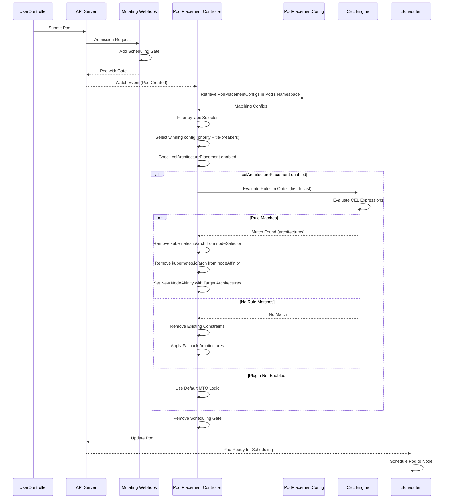
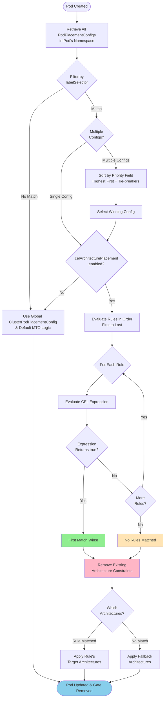
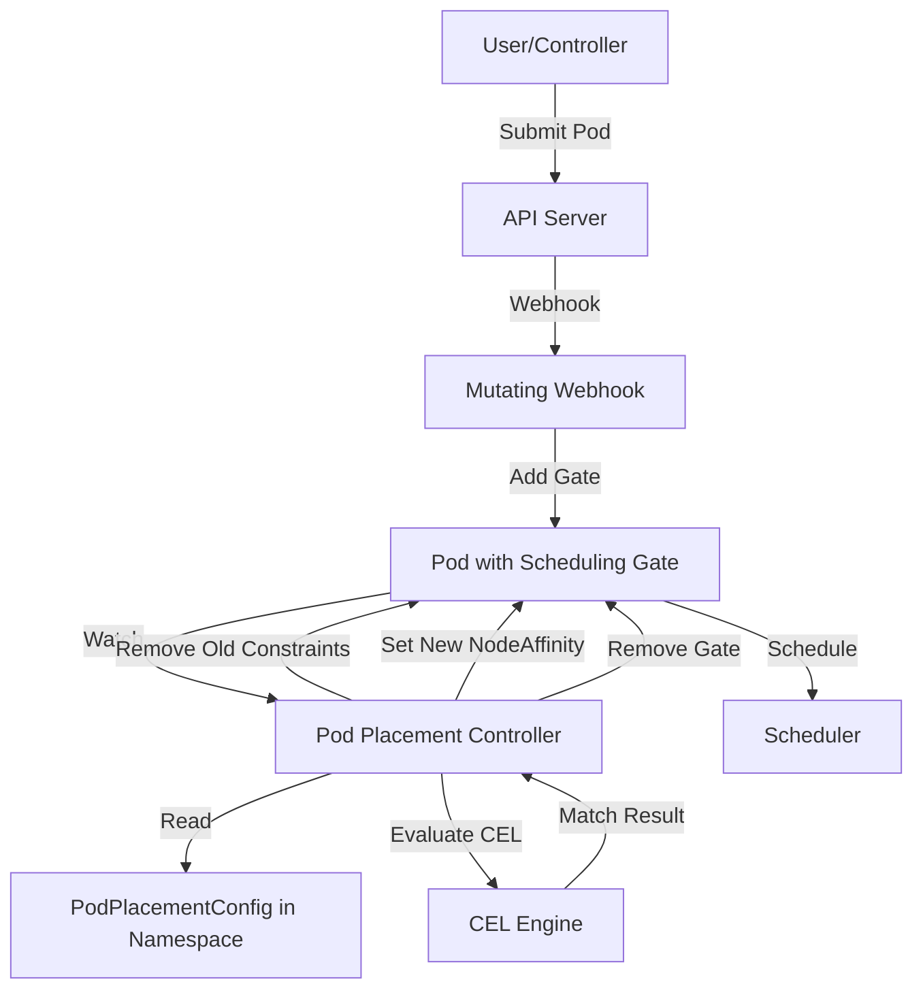

# CEL Architecture Placement Plugin

## Release Signoff Checklist

- [ ] Enhancement is `implementable`
- [ ] Design details are appropriately documented from clear requirements
- [ ] Test plan is defined
- [ ] Graduation criteria for dev preview, tech preview, GA
- [ ] User-facing documentation is created in [openshift-docs](https://github.com/openshift/openshift-docs/)

## Summary

This enhancement proposes a new plugin called `celArchitecturePlacement` for the Multiarch Tuning Operator (MTO) that enables fine-grained control over pod architecture placement using Common Expression Language (CEL) expressions. The plugin is available exclusively in namespace-scoped [`PodPlacementConfig`](../../api/v1beta1/podplacementconfig_types.go) resources, allowing administrators to define rules that evaluate a Pod's metadata and automatically adjust the target architecture based on matching criteria. When a rule matches, the plugin removes any existing architecture constraints from the pod's nodeSelector and nodeAffinity, then sets a list of allowed architectures. This approach provides a declarative and image independent architecture that goes beyond the current image-based architecture detection.

## Motivation

The current Multiarch Tuning Operator automatically determines Pod image architecture compatibility by inspecting container images. While this works well for most scenarios, there are cases where administrators need more control at the namespace level:

1. **Workload-specific architecture preferences** Some workloads may benefit from specific architectures based on their component affinity (e.g., database pods on ppc64le, web servers on amd64)
2. **Operator namespace support** Operators running in a shared namespace, such as `openshift-operators` or other shared namespaces may need architecture-specific placement rules that influence the operands subsequent architecture.
3. **Override image-based detection** In some cases, administrators may want to override the architecture determined by image inspection, especially when using multi-arch images or when the image architecture is not the desired runtime architecture.

### User Stories

- As a platform engineer, I want to override pod placement behavior to specific architectures without modifying the underlying application.
- As a namespace administrator, I want to use well-known Kubernetes labels (like `app.kubernetes.io/component`) to determine architecture placement for different application tiers in my namespace, tuning any architecture constraints.

### Goals

- Enable fine-grained control over Pod placement based on a Pod's metadata
- Provide a flexible, CEL-based rule engine for Pod identification and when identified place Pods specifically in a multi-arch compute environment
- Support namespace-scoped architecture rules using a new plugin in `PodPlacementConfig`
- Remove existing architecture constraints and set new ones when rules match
- Maintain compatibility with existing MTO functionality
- Limit the explosion of rules by requiring a fallback architecture list
- Support operator namespaces including `openshift-operators`

### Non-Goals

- Provide cluster-wide architecture rules
- Replace the existing image-based architecture detection mechanism entirely
- Provide runtime architecture switching for already-scheduled pods
- Support CEL expressions on resources other than Pods
- Expose Pod `spec`/`status` (container images, env, volumes, secrets) to CEL expressions
- Automatically detect optimal architecture for workloads
- Preserve existing architecture constraints when rules match (they are explicitly removed)

## Proposal

We propose introducing a new plugin called `celArchitecturePlacement` that can be configured in [`PodPlacementConfig`](../../api/v1beta1/podplacementconfig_types.go) (namespace-scoped) resources. This design choice ensures that architecture rules are applied at the namespace level with established control boundaries for multi-tenant applications (operators that install multiple times into different namespaces).

### Workflow Description

#### Configuration

1. The namespace administrator creates or updates a `PodPlacementConfig` resource in their namespace with the `celArchitecturePlacement` plugin enabled
2. The administrator defines:
   - A list of fallback architectures (required, e.g., `[ppc64le, amd64]`)
   - One or more `ArchitectureRule` objects, each containing:
     - A name for the rule
     - A CEL expression that evaluates against a Pod's metadata
     - A target architecture list to apply when the expression matches

#### Pod Admission and Processing

1. A pod is submitted to the API server in a namespace with a `PodPlacementConfig` containing `celArchitecturePlacement`
2. The MTO mutating webhook adds a scheduling gate (existing behavior)
3. The Pod Placement Controller processes the pod:
   - Retrieves all `PodPlacementConfig` resources in the pod's namespace
   - Filters configs whose `labelSelector` matches the pod
   - Selects a single **winning** config deterministically by the `priority` field (highest first), with documented tie-breakers (see [Priority and Conflict Resolution](#priority-and-conflict-resolution)). The controller does not merge rules across configs.
   - If the winning config has `celArchitecturePlacement.enabled` set to `true`, its rules are evaluated in order:
     - If a rule matches (CEL expression returns `true`):
       - **Removes any existing architecture constraints** from the `Pod` `spec.nodeSelector` (removes `kubernetes.io/arch` key if present)
       - **Removes any existing architecture-based node affinity** from the pod's `spec.affinity.nodeAffinity` (removes node selector terms with `kubernetes.io/arch` match expressions)
       - **Sets new node affinity** with the rule's target architecture list
     - If no rules match, the winning config's `fallbackArchitectures` is applied (also removing existing constraints)
   - If no config matches, the global `ClusterPodPlacementConfig` and the default MTO logic are used
   - The scheduling gate is removed
4. The updated `Pod` is sent to the scheduler



#### Reconcile Ordering (Single Pass)

Within a single reconcile of a gated Pod, the Pod Placement Controller executes stages in a fixed, deterministic order. This makes behavior predictable and tests specifiable, and it removes ambiguity about whether image-based logic runs before or after CEL and what NodeAffinityScoring observes:

1. **Stage 0 — Config selection** Select the winning `PodPlacementConfig` (label selector match, then `priority`, then tie-breakers).
2. **Stage 1 — celArchitecturePlacement (selection)** If enabled, evaluate rules. On a rule match (or via `fallbackArchitectures` when no rule matches), remove existing `kubernetes.io/arch` constraints and set the required node affinity. This produces the **authoritative required architecture set**.
   - When `celArchitecturePlacement` is enabled and selects an architecture set, **image-based architecture detection is skipped** for this Pod. Image-based logic does not run before or after CEL in this pass; `celArchitecturePlacement` fully owns the required arch set.
   - When `celArchitecturePlacement` is not enabled (or the plugin is absent), image-based detection runs exactly as it does today.
3. **Stage 2 — NodeAffinityScoring (preference)** Runs after Stage 1 and reads the **final** required architecture set produced by Stage 1. It only adds `preferredDuringSchedulingIgnoredDuringExecution` weights among the already-eligible architectures; it never changes the required set.
4. **Stage 3 — Gate removal** Remove the scheduling gate and persist the Pod.

Invariants:

- Image-based detection and `celArchitecturePlacement` are mutually exclusive per Pod; they never both mutate the required arch set in the same pass.
- `NodeAffinityScoring` always observes the final required set from Stage 1, never an intermediate state.

#### Architecture Constraint Removal

When the plugin applies architecture rules, it performs the following operations:

1. **NodeSelector Cleanup** Removes the `kubernetes.io/arch` key from `spec.nodeSelector` if present
2. **NodeAffinity Cleanup** Removes any `matchExpressions` with key `kubernetes.io/arch` from all node selector terms in `spec.affinity.nodeAffinity.requiredDuringSchedulingIgnoredDuringExecution`. `preferredDuringSchedulingIgnoredDuringExecution` would be untouched.
3. **New Affinity Application** Adds new node affinity requirements with the target architecture list

This ensures that the plugin's architecture selection takes precedence over any existing constraints, whether they were set by:

- User-defined node selectors
- Other controllers or operators
- Previous MTO processing
- Image-based architecture detection

#### Example: PodPlacementConfig

The example sets a fallback architecture of amd64, a rule matching database Pods to place them on ppc64le, and another rule to place `redis-` Pods on amd64 or arm64. The `priority` field selects this config over any lower-priority config in the same namespace; it defaults to `0` when unset.

```yaml
apiVersion: multiarch.openshift.io/v1beta1
kind: PodPlacementConfig
metadata:
  name: database-rules
  namespace: production
spec:
  priority: 10
  labelSelector:
    matchLabels:
      tier: database
  plugins:
    celArchitecturePlacement:
      enabled: true
      fallbackArchitectures:
        - amd64
      rules:
        - name: postgres-on-ppc64le
          expression: |
            'app.kubernetes.io/component' in self.metadata.labels &&
            self.metadata.labels['app.kubernetes.io/component'] == 'database' &&
            'app.kubernetes.io/part-of' in self.metadata.labels &&
            self.metadata.labels['app.kubernetes.io/part-of'] == 'postgresql'
          architectures:
            - ppc64le
        - name: redis-on-amd64-and-arm64
          expression: |
            self.metadata.name.startsWith('redis-')
          architectures:
            - amd64
            - arm64
```

**Before plugin processing**

A Pod with existing architecture constraint is shown:

```yaml
apiVersion: v1
kind: Pod
metadata:
  name: postgres-db
  labels:
    app.kubernetes.io/component: database
    app.kubernetes.io/part-of: postgresql
spec:
  nodeSelector:
    kubernetes.io/arch: amd64  # Existing constraint
  containers:
  - name: postgres
    image: postgres:latest
```

**After plugin processing**

The existing constraint is removed, and the new constraint applied:

```yaml
apiVersion: v1
kind: Pod
metadata:
  name: postgres-db
  labels:
    app.kubernetes.io/component: database
    app.kubernetes.io/part-of: postgresql
spec:
  # nodeSelector.kubernetes.io/arch removed
  affinity:
    nodeAffinity:
      requiredDuringSchedulingIgnoredDuringExecution:
        nodeSelectorTerms:
        - matchExpressions:
          - key: kubernetes.io/arch
            operator: In
            values:
            - ppc64le  # New constraint from rule
  containers:
  - name: postgres
    image: postgres:latest
```

### API Extensions

#### Changes to PodPlacementConfig

The [`PodPlacementConfig`](../../api/v1beta1/podplacementconfig_types.go) CRD will be extended to support the new `celArchitecturePlacement` plugin in the `LocalPlugins` struct. Following the existing `NodeAffinityScoring` plugin, the struct type and its fields are **exported** so that Go's JSON serializer includes them and kubebuilder can generate the CRD schema:

```go
// LocalPlugins represents the plugins configuration for podplacementconfigs resource.
type LocalPlugins struct {
    NodeAffinityScoring      *NodeAffinityScoring      `json:"nodeAffinityScoring,omitempty"`
    CELArchitecturePlacement *CELArchitecturePlacement `json:"celArchitecturePlacement,omitempty"`
}
```

**Note** The `celArchitecturePlacement` plugin is exclusively namespace-scoped and is **not** added to the `Plugins` struct in [`ClusterPodPlacementConfig`](../../api/v1beta1/clusterpodplacementconfig_types.go).

#### CELArchitecturePlacement Plugin Definition

A plugin definition will be added to [`api/common/plugins/`](../../api/common/plugins/). The exported type name (`CELArchitecturePlacement`) uses the Go initialism convention (all-caps `CEL`), while the plugin's registered name and JSON tag remain `celArchitecturePlacement`:

```go
const (
    // CELArchitecturePlacementPluginName stores the name for the celArchitecturePlacement plugin.
    CELArchitecturePlacementPluginName = "celArchitecturePlacement"
)

// CELArchitecturePlacement is a plugin that provides CEL-based architecture selection rules.
// This plugin is only available in namespace-scoped PodPlacementConfig resources.
// When a rule matches, the plugin removes any existing architecture constraints from the pod's
// nodeSelector and nodeAffinity, then sets new architecture constraints based on the rule.
type CELArchitecturePlacement struct {
    BasePlugin `json:",inline"`

    // FallbackArchitectures is a required list of architectures to use when no rules match.
    // This limits the explosion of possible rules by providing a sensible default.
    // When applied, existing architecture constraints are removed and replaced with these architectures.
    // +kubebuilder:validation:Required
    // +kubebuilder:validation:MinItems=1
    // +kubebuilder:validation:MaxItems=4
    FallbackArchitectures []string `json:"fallbackArchitectures" protobuf:"bytes,2,rep,name=fallbackArchitectures"`

    // Rules is a list of architecture selection rules evaluated in order.
    // The first matching rule determines the target architecture.
    // When a rule matches, existing architecture constraints are removed and replaced.
    // +optional
    // +kubebuilder:validation:MaxItems=1000
    Rules []ArchitectureRule `json:"rules,omitempty" protobuf:"bytes,3,rep,name=rules"`
}

// ArchitectureRule defines a single CEL-based rule for architecture selection
type ArchitectureRule struct {
    // Name is a descriptive name for this rule
    // +kubebuilder:validation:Required
    // +kubebuilder:validation:MinLength=1
    // +kubebuilder:validation:MaxLength=253
    Name string `json:"name" protobuf:"bytes,1,opt,name=name"`

    // Expression is a CEL expression that evaluates against a Pod's metadata.
    // The expression must return a boolean value.
    // The expression has access to the pod via the 'self' variable, but only
    // metadata fields (self.metadata.name, self.metadata.namespace,
    // self.metadata.labels, self.metadata.annotations) may be referenced.
    // References to spec/status fields are rejected at admission time.
    // +kubebuilder:validation:Required
    // +kubebuilder:validation:MinLength=1
    Expression string `json:"expression" protobuf:"bytes,2,opt,name=expression"`

    // Architectures is the list of target architectures to use when this rule matches.
    // When applied, any existing architecture constraints in the pod's nodeSelector
    // and nodeAffinity are removed and replaced with these architectures.
    // +kubebuilder:validation:Required
    // +kubebuilder:validation:MinItems=1
    // +kubebuilder:validation:MaxItems=4
    Architectures []string `json:"architectures" protobuf:"bytes,3,rep,name=architectures"`
}

// Name returns the name of the CELArchitecturePlacement plugin.
func (c *CELArchitecturePlacement) Name() string {
    return CELArchitecturePlacementPluginName
}

// ValidateArchitectures checks whether the architectures are valid
func (c *CELArchitecturePlacement) ValidateArchitectures() error {
    validArchs := map[string]bool{
        "amd64": true, "arm64": true, "ppc64le": true, "s390x": true,
    }

    // Validate fallback architectures
    for _, arch := range c.FallbackArchitectures {
        if !validArchs[arch] {
            return fmt.Errorf("invalid fallback architecture: %s", arch)
        }
    }

    // Validate rule architectures
    for _, rule := range c.Rules {
        for _, arch := range rule.Architectures {
            if !validArchs[arch] {
                return fmt.Errorf("invalid architecture in rule %s: %s", rule.Name, arch)
            }
        }
    }

    return nil
}

// ValidateCELExpressions validates all CEL expressions in the plugin.
// The CEL environment binds `self` to a Pod, but only metadata fields
// (name, namespace, labels, annotations) may be referenced. Expressions
// that reference spec/status fields (containers, images, env, volumes, etc.)
// are rejected so rules cannot read sensitive workload data.
func (c *CELArchitecturePlacement) ValidateCELExpressions() error {
    env, err := cel.NewEnv(
        cel.Types(&corev1.Pod{}),
        cel.Variable("self", cel.ObjectType("k8s.io.api.core.v1.Pod")),
    )
    if err != nil {
        return fmt.Errorf("failed to create CEL environment: %w", err)
    }

    for _, rule := range c.Rules {
        ast, issues := env.Compile(rule.Expression)
        if issues != nil && issues.Err() != nil {
            return fmt.Errorf("rule %q: CEL compilation error: %w", rule.Name, issues.Err())
        }

        // Verify expression returns boolean
        if ast.OutputType() != cel.BoolType {
            return fmt.Errorf("rule %q: expression must return boolean, got %s",
                rule.Name, ast.OutputType())
        }

        // Enforce the metadata-only field allow-list: reject any reference to
        // Pod spec/status so expressions cannot read container images, env
        // vars, volumes, or other sensitive fields.
        if err := assertMetadataOnly(ast, rule.Name); err != nil {
            return err
        }
    }

    return nil
}
```

#### CEL Data Scope and Field Allow-list

`self` is bound to the Pod type so that field references can be schema-checked, but the webhook enforces a **metadata-only field allow-list**. Only the following are permitted:

- `self.metadata.name`
- `self.metadata.namespace`
- `self.metadata.labels`
- `self.metadata.annotations`

Any reference to `self.spec` or `self.status` (for example `self.spec.containers`, image names, environment variables, volumes) is rejected at `PodPlacementConfig` create/update time (`assertMetadataOnly`). This guarantees the plugin cannot read sensitive workload data and keeps the risk statement about data exposure accurate.

#### CEL Label and Annotation Access

Pod labels and annotations are Kubernetes `map<string, string>` values, not lists. Under cel-go with the Kubernetes Pod binding they must be accessed with **map indexing and the `in` operator (or the `has()` macro)** — not the list `.exists(l, l.key == ...)` macro, which operates on lists and does not apply to maps.

```cel
// Correct (map access):
'app.kubernetes.io/component' in self.metadata.labels &&
self.metadata.labels['app.kubernetes.io/component'] == 'database'

// Incorrect (list macro on a map — does not compile/behave as intended):
self.metadata.labels.exists(l, l.key == 'app.kubernetes.io/component' && l.value == 'database')
```

All examples below use the map-access form.

#### CEL Expression Validation

The PodPlacementConfig webhook performs the following validations at create/update time:

1. **CEL Syntax Validation**: Each rule's CEL expression is compiled using the Kubernetes CEL library to ensure syntactic correctness
2. **Type Checking**: Expressions are validated to ensure they return boolean values
3. **Pod Schema Validation**: Expressions are checked against the Pod type schema to catch invalid field references
4. **Metadata-only Enforcement**: Expressions referencing `self.spec`/`self.status` are rejected (see field allow-list above)
5. **Compilation Errors**: Any CEL compilation errors result in webhook rejection with a descriptive error message

**Example validation errors:**
- `"expression 'self.metadata.invalidField' is invalid: no such field 'invalidField'"`
- `"expression 'self.metadata.name' must return boolean, got string"`
- `"expression 'self.spec.containers' references a disallowed field: only self.metadata.* is permitted"`
- `"expression syntax error at position 15: unexpected token ')'"`

This validation ensures that only syntactically correct, type-safe, and metadata-scoped CEL expressions are stored in the cluster.

**Note** Separate Custom Resources for each rule were considered. The PodPlacementConfig with celArchitecturePlacement plugin supports up to 1000 rules within etcd key-value storage limits. PodPlacementConfig has a limit of 1000 rules in a custom resource.

#### Plugin Registration

The plugin will be registered in the `localPluginChecks` map in [`api/common/plugins/base_plugin.go`](../../api/common/plugins/base_plugin.go):

```go
// localPluginChecks is a map that associates a plugin name with a function that can
// safely check if that specific plugin is enabled on a LocalPlugins struct.
var localPluginChecks = map[common.Plugin]func(lp *LocalPlugins) bool{
    common.NodeAffinityScoringPluginName: func(lp *LocalPlugins) bool {
        return lp.NodeAffinityScoring != nil && lp.NodeAffinityScoring.IsEnabled()
    },
    common.CELArchitecturePlacementPluginName: func(lp *LocalPlugins) bool {
        return lp.CELArchitecturePlacement != nil && lp.CELArchitecturePlacement.IsEnabled()
    },
}
```

### CEL Expression Examples

The plugin supports CEL expressions that operate on a Pod's metadata. Here are common patterns:

1. *Matching by Pod Name*

```yaml
- name: nginx-pods
  expression: self.metadata.name == 'nginx-example'
  architectures:
    - amd64
```

For a pod:
```yaml
apiVersion: v1
kind: Pod
metadata:
  name: nginx-example
  labels:
    app: web
spec:
  containers:
  - name: nginx-container
    image: nginx:latest
```

2. *Matching by Well-Known Labels*

```yaml
- name: database-components
  expression: |
    'app.kubernetes.io/component' in self.metadata.labels &&
    self.metadata.labels['app.kubernetes.io/component'] == 'database' &&
    'app.kubernetes.io/part-of' in self.metadata.labels &&
    self.metadata.labels['app.kubernetes.io/part-of'] == 'wordpress'
  architectures:
    - ppc64le
```

For a pod:

```yaml
apiVersion: v1
kind: Pod
metadata:
  name: db-example
  labels:
    app.kubernetes.io/component: "database"
    app.kubernetes.io/part-of: "wordpress"
spec:
  containers:
  - name: db-container
    image: db:latest
```

3. *Matching by Name Prefix*

```yaml
- name: redis-pods
  expression: self.metadata.name.startsWith('redis-')
  architectures:
    - amd64
```

For a pod:
```yaml
apiVersion: v1
kind: Pod
metadata:
  name: redis-1
spec:
  containers:
  - name: redis
    image: redis:latest
```

4. *Matching by Multiple Labels*

```yaml
- name: frontend-production
  expression: |
    'tier' in self.metadata.labels &&
    self.metadata.labels['tier'] == 'frontend' &&
    'environment' in self.metadata.labels &&
    self.metadata.labels['environment'] == 'production'
  architectures:
    - arm64
```

For a pod:

```yaml
apiVersion: v1
kind: Pod
metadata:
  name: db-example
  labels:
    tier: "frontend"
    environment: "production"
spec:
  containers:
  - name: db-container
    image: db:latest
```

5. *Complex Label Matching with Multiple Architectures*

```yaml
- name: critical-services
  expression: |
    (('priority' in self.metadata.labels) && self.metadata.labels['priority'] == 'critical') ||
    (('tier' in self.metadata.labels) && self.metadata.labels['tier'] == 'backend' &&
     ('sla' in self.metadata.labels) && self.metadata.labels['sla'] == 'gold')
  architectures:
    - ppc64le
    - amd64
```

For a pod:

```yaml
apiVersion: v1
kind: Pod
metadata:
  name: db-example
  labels:
    priority: "critical"
    tier: "backend"
    sla: "gold"
spec:
  containers:
  - name: db-container
    image: db:latest
```

Mutates the Pod to become:

```yaml
apiVersion: v1
kind: Pod
metadata:
  name: db-example
  labels:
    priority: "critical"
    tier: "backend"
    sla: "gold"
spec:
  containers:
  - name: db-container
    image: db:latest
  affinity:
    nodeAffinity:
      requiredDuringSchedulingIgnoredDuringExecution:
        nodeSelectorTerms:
        - matchExpressions:
          - key: kubernetes.io/arch
            operator: In
            values:
            - ppc64le
            - amd64
```

### CEL Language Reference

The CEL expressions used in this plugin follow the Kubernetes CEL implementation:
- [Kubernetes CEL Documentation](https://kubernetes.io/docs/reference/using-api/cel/)
- [CEL Language Specification](https://cel.dev/)

The implementation will use the [`github.com/google/cel-go`](https://github.com/google/cel-go) library for CEL evaluation. Because Kubernetes protobuf types expose `labels`/`annotations` as `map<string, string>`, expressions use map indexing and the `in`/`has()` operators rather than list macros (see [CEL Label and Annotation Access](#cel-label-and-annotation-access)).

### Plugin Activation

The `celArchitecturePlacement` plugin is activated per-namespace using [`PodPlacementConfig`](../../api/v1beta1/podplacementconfig_types.go):

```yaml
apiVersion: multiarch.openshift.io/v1beta1
kind: PodPlacementConfig
metadata:
  name: my-rules
  namespace: production
spec:
  priority: 0  # optional; defaults to 0 when unset
  plugins:
    celArchitecturePlacement:
      enabled: true
      fallbackArchitectures:
        - ppc64le
        - amd64
```

**Per-namespace activation** is already supported in the current MTO architecture. The [`PodPlacementConfig`](../../api/v1beta1/podplacementconfig_types.go) CRD is namespace-scoped and the Pod Placement Controller already handles namespace-scoped plugin evaluation as seen in [`pod_reconciler.go`](../../internal/controller/podplacement/pod_reconciler.go).

### Namespace Support

The `celArchitecturePlacement` plugin works in any namespace where a `PodPlacementConfig` is created, including:

1. **User Namespaces** Any namespace where users deploy workloads
2. **Operator Namespaces** Including the well-known `openshift-operators` namespace where OLM-managed operators run.
3. **Custom Operator Namespaces** Any namespace where operators are deployed

The plugin respects the existing namespace filtering logic in the MTO, which excludes:
- The operator's own namespace (where MTO runs)
- System namespaces matching `kube-*` pattern (unless explicitly configured)
- Namespaces matching `hypershift-*` pattern (unless explicitly configured)

### Fallback Architectures Rationale

The `fallbackArchitectures` field is required for several important reasons:

1. **Limits Rule Explosion and Configuration Burden** Without a default, administrators would need to create rules for every possible pod pattern, leading to complex and hard-to-maintain configurations. The plugin supports _exceptional_ cases in the same namespace.

2. **Provides Fallback Behavior** When no rules match, the system needs a sensible default rather than failing or using arbitrary behavior.

3. **Simplifies Migration** During multi-architecture migrations, administrators can set a default (e.g., `[amd64]`) and gradually add rules for workloads ready to move to other architectures

4. **Consistent Behavior** Whether a rule matches or not, the plugin always removes existing architecture constraints and sets new ones, ensuring predictable behavior

#### Precedence: namespace `fallbackArchitectures` vs. cluster `fallbackArchitecture`

The [`ClusterPodPlacementConfig`](../../api/v1beta1/clusterpodplacementconfig_types.go) exposes a cluster-scoped [`fallbackArchitecture`](https://github.com/outrigger-project/multiarch-tuning-operator/blob/main/api/v1beta1/clusterpodplacementconfig_types.go#L58) field. When both it and the namespace-scoped `celArchitecturePlacement.fallbackArchitectures` are set, **the namespace value takes precedence**. The resolution order is:

1. If a matching rule fires, its `architectures` are used.
2. Else, if the winning `PodPlacementConfig` sets `fallbackArchitectures`, that list is used.
3. Else, the cluster `ClusterPodPlacementConfig.fallbackArchitecture` is used.
4. Else, the default MTO image-based logic applies.

In short: when both are configured, the namespace `fallbackArchitectures` wins; the cluster `fallbackArchitecture` is consulted only when the namespace value is absent.

**Example** An administrator migrating a namespace from x86_64 to a mixed x86_64/ppc64le cluster might configure:

```yaml
fallbackArchitectures:
  - amd64  # Safe default for existing workloads
rules:
  - name: new-services-on-ppc64le
    expression: |
      'migration-ready' in self.metadata.labels &&
      self.metadata.labels['migration-ready'] == 'true'
    architectures:
      - ppc64le
```

This allows a gradual, controlled migration where:
- Pods marked with `migration-ready=true` have their existing architecture constraints removed and are set to run on ppc64le
- All other pods have their existing architecture constraints removed and are set to run on amd64 (the fallback)

### Implementation Details/Notes/Constraints

#### CEL Expression Evaluation

1. **CEL Environment Setup** The Pod Placement Controller creates a CEL environment with the Pod type registered and the metadata-only field allow-list enforced (only `self.metadata.*` is accessible)
2. **Expression Compilation** CEL expressions compile once during configuration loading and are cached
3. **Expression Evaluation** For each pod, expressions are evaluated in the order defined in the rules list
4. **First Match Wins** The first rule whose expression evaluates to `true` determines the target architecture
5. **Error Handling**:
   - **Validation-time**: Invalid CEL expressions are rejected by the webhook during PodPlacementConfig create/update
   - **Runtime evaluation errors**: If a CEL expression fails to evaluate at runtime (e.g., due to unexpected pod state), it is logged and treated as `false`, allowing evaluation to continue with the next rule
   - **Pod admission**: Pod admission never fails due to CEL evaluation errors. If all rules error or no rules match, the fallbackArchitectures are applied
   - **Soft failure model**: The plugin always allows pod admission to proceed, either with matched rule architectures, fallback architectures, or by falling through to the global ClusterPodPlacementConfig/default MTO logic



#### Architecture Constraint Removal Logic

When the plugin applies architecture rules, it performs these operations in order:

1. **Remove from NodeSelector**
   ```go
   if pod.Spec.NodeSelector != nil {
       delete(pod.Spec.NodeSelector, "kubernetes.io/arch")
   }
   ```

2. **Remove from NodeAffinity**
   - Iterate through all node selector terms in `requiredDuringSchedulingIgnoredDuringExecution`
   - Remove any `matchExpressions` with key `kubernetes.io/arch`
   - Remove empty node selector terms after cleanup

3. **Apply New Architecture Constraints**
   - Add new node affinity requirements with the target architecture list
   - Use the `In` operator with the list of allowed architectures

#### Integration with Existing MTO Components

The stage ordering for a single reconcile pass is defined in [Reconcile Ordering (Single Pass)](#reconcile-ordering-single-pass). The components involved are:

1. **Pod Placement Controller** is extended to:
   - Evaluate CEL expressions from `PodPlacementConfig` resources
   - Remove existing architecture constraints from pods
   - Apply new architecture rules based on CEL evaluation results

2. **Mutating Webhook** Continue to add scheduling gates, and add annotations with the rule name and `PodPlacementConfig` responsible for the placement.

3. **Image Inspection** The `celArchitecturePlacement` plugin takes precedence over image-based detection when enabled. When the plugin selects an architecture set (Stage 1), image-based detection is skipped for that Pod; existing architecture constraints (including any previously set by image inspection) are removed.

4. **NodeAffinityScoring Plugin** Can coexist with `celArchitecturePlacement` in the same `PodPlacementConfig`:
   - `celArchitecturePlacement` (Stage 1) determines which architectures are eligible (removes old constraints, sets the required set)
   - `NodeAffinityScoring` (Stage 2) reads the final required set and determines preferences among the eligible architectures via `preferredDuringSchedulingIgnoredDuringExecution`; it never modifies the required set

#### Webhook Validation Implementation

The PodPlacementConfig webhook (`internal/controller/podplacementconfig/podplacementconfig_webhook.go`) is extended to validate CEL expressions when the `celArchitecturePlacement` plugin is enabled. This validation is called from the webhook's Handle method during create/update operations.

The validation ensures:
1. **CEL compilation succeeds**: Each expression compiles without syntax errors
2. **Type safety**: Expressions return boolean values
3. **Schema correctness**: Field references are valid for Pod objects
4. **Metadata-only scope**: Only `self.metadata.*` is referenced; spec/status references are rejected
5. **Early failure**: Invalid configurations are rejected before being stored in etcd

This prevents runtime evaluation errors caused by malformed CEL expressions, while runtime errors from unexpected pod states are still handled gracefully with the soft failure model.

#### Priority and Conflict Resolution

Multiple `PodPlacementConfig` resources may exist in the same namespace, and more than one may match a Pod through its `labelSelector`. A single winning config is selected deterministically:

1. **Label selector filtering** Only configs whose `labelSelector` matches the Pod are considered.
2. **Priority (primary)** Candidate configs are ordered by the `priority` field, highest first. `priority` defaults to `0` when unset.
3. **Tie-breakers (deterministic)** If two or more configs share the same highest priority:
   1. The oldest `metadata.creationTimestamp` wins.
   2. If timestamps are equal, the lexicographically smallest `metadata.name` wins.
4. **Rule evaluation** Only the winning config's rules are evaluated, in the order they appear; the first matching rule determines the architecture.
5. **Fallback** If no rule in the winning config matches, that config's `fallbackArchitectures` is applied.
6. In all cases, existing architecture constraints are removed before new ones are applied.

The controller selects a single winning config and does not merge rules across configs, highest priority config and rule win. This keeps precedence unambiguous while still allowing several configs — with distinct priorities — to coexist in a namespace, which is the intended purpose of the `priority` field.

#### Performance Considerations

1. **CEL Compilation** Expressions are compiled once at configuration time
2. **Expression Caching** Compiled expressions are cached to avoid repeated compilation
3. **Evaluation Overhead** CEL evaluation is fast (microseconds per expression)
4. **Rule Limit** Maximum of 1000 rules per configuration to prevent excessive evaluation time. This limit will be reviewed after use.
5. **Namespace Scope** Only configs in the pod's namespace are evaluated, limiting the search space
6. **Constraint Removal** Removing existing constraints is a fast operation (map/slice manipulation)

### Risks and Mitigations

| Risk | Impact | Mitigation |
|------|--------|------------|
| Complex CEL expressions cause evaluation errors | Pods may not be scheduled correctly | Validate expressions at admission time; provide clear error messages; treat evaluation errors as non-matches |
| Misconfigured rules assign pods to incompatible architectures | Pods fail to start with ENOEXEC errors | Document best practices; recommend testing rules in non-production environments; existing ENOEXEC monitoring will detect issues |
| Too many rules impact performance | Increased pod scheduling latency | Limit maximum rules per configuration (1000); compile and cache expressions; provide performance guidelines |
| Conflicting rules between multiple PodPlacementConfigs | Unpredictable behavior | Deterministic winner selection: `priority` (highest first), then oldest `creationTimestamp`, then smallest `name`; only the winning config's rules are evaluated; document evaluation order |
| CEL expressions access sensitive pod data | Potential information disclosure | `self` is bound to a Pod, but admission validation enforces a metadata-only field allow-list: expressions may reference only `self.metadata` (name, namespace, labels, annotations). Any reference to `self.spec`/`self.status` (container images, env, volumes, secrets) is rejected at PodPlacementConfig create/update time |
| Namespace administrators misconfigure operator pods | Operators fail to start | Provide clear documentation and examples for operator namespaces; recommend testing in non-production environments first |
| Removing user-defined architecture constraints causes unexpected behavior | Pods scheduled on unintended architectures | Document that plugin removes existing constraints; provide clear examples; recommend testing before production use |
| Plugin overrides critical architecture requirements | System instability | Document that plugin takes precedence; recommend careful rule design; suggest using label selectors to limit scope |

### Drawbacks

1. **Increased Complexity** Adds another layer of configuration that administrators must understand
2. **CEL Learning Curve** Administrators need to learn CEL syntax to write effective rules
3. **Potential for Misconfiguration** Incorrect rules could route pods to incompatible architectures
4. **Maintenance Burden** Rules may need updates as workload patterns change
5. **Namespace-only Scope** Cannot define cluster-wide architecture rules (by design, to maintain clear ownership boundaries)
6. **Removes Existing Constraints** The plugin explicitly removes existing architecture constraints, which may be unexpected for users who set them intentionally
7. **Override Behavior** Takes precedence over image-based detection and user-defined constraints, which requires careful configuration

## Design Details

### Deployment Model

The `celArchitecturePlacement` plugin is implemented entirely within the existing Pod Placement Controller. No new deployments or services are required.



### Test Plan

#### Unit Testing

- Test CEL expression compilation and caching
- Test expression evaluation with various pod configurations
- Test rule matching logic and priority handling
- Test fallback architecture behavior
- Test validation of architecture values
- Test error handling for invalid CEL expressions
- Test the metadata-only field allow-list (spec/status references rejected)
- Test plugin registration in `localPluginChecks`
- Test removal of existing architecture constraints from nodeSelector
- Test removal of existing architecture constraints from nodeAffinity
- Test application of new architecture constraints

### 1. **CEL Architecture Placement Plugin Core (`api/common/plugins/celArchitecturePlacement_plugin.go`)**

#### Architecture Validation (`ValidateArchitectures()` method):

- Test with valid fallback architectures (amd64, arm64, ppc64le, s390x)
- Test with invalid fallback architecture (should fail)
- Test with empty fallback architectures list (should fail based on MinItems=1)
- Test with too many fallback architectures (>4, should fail based on MaxItems=4)
- Test with valid rule architectures
- Test with invalid rule architectures in various rules
- Test with mixed valid/invalid architectures
- Test with duplicate architectures in fallback list (should be allowed)
- Test with duplicate architectures across different rules (should be allowed)

#### Rule Validation:

- Test with empty rules list (should be valid - fallback is used)
- Test with maximum rules (1000 rules allowed)
- Test with too many rules (>1000, should fail)
- Test rule name validation (min length 1, max length 253)
- Test rule expression validation (min length 1, required)
- Test rule architectures validation (min 1, max 4 items)

### 2. **CEL Expression Compilation and Evaluation**

#### Expression Compilation:

- Test successful compilation of valid CEL expressions
- Test compilation failure with invalid CEL syntax
- Test compilation caching (verify expressions are compiled once)
- Test compilation with various CEL operators (==, !=, &&, ||, `in`, `has`, startsWith, etc.)
- Test rejection of expressions referencing `self.spec`/`self.status` (metadata-only allow-list)

#### Expression Evaluation:

- Test evaluation with pod name matching (`self.metadata.name == 'nginx-example'`)
- Test evaluation with pod name prefix (`self.metadata.name.startsWith('redis-')`)
- Test evaluation with single label match (map access, `'k' in self.metadata.labels`)
- Test evaluation with multiple label matches (AND logic)
- Test evaluation with multiple label matches (OR logic)
- Test evaluation with well-known Kubernetes labels (app.kubernetes.io/*)
- Test evaluation with complex nested expressions
- Test evaluation returning true
- Test evaluation returning false
- Test evaluation error handling (expression fails, should treat as false)
- Test evaluation with missing labels (should handle gracefully via `in`/`has`)
- Test evaluation with nil/empty pod metadata

### 3. **Architecture Constraint Removal Logic**

#### NodeSelector Removal:

- Test removal of `kubernetes.io/arch` from nodeSelector when present
- Test handling when nodeSelector is nil
- Test handling when nodeSelector exists but doesn't have arch key
- Test preservation of other nodeSelector keys

#### NodeAffinity Removal:

- Test removal of `kubernetes.io/arch` matchExpressions from requiredDuringSchedulingIgnoredDuringExecution
- Test removal from multiple nodeSelectorTerms
- Test removal of empty nodeSelectorTerms after cleanup
- Test handling when nodeAffinity is nil
- Test handling when requiredDuringSchedulingIgnoredDuringExecution is nil
- Test preservation of other matchExpressions (non-arch keys)
- Test that preferredDuringSchedulingIgnoredDuringExecution is NOT modified

#### New Constraint Application:

- Test application of single architecture constraint
- Test application of multiple architecture constraints (2, 3, 4 architectures)
- Test proper use of "In" operator
- Test proper structure of nodeSelectorTerms and matchExpressions

### 4. **Fallback Architecture Logic**

- Test fallback when no rules are defined
- Test fallback when no rules match
- Test fallback when all rules evaluate to false
- Test fallback when CEL evaluation errors occur
- Test that fallback also removes existing constraints before applying
- Test precedence: namespace `fallbackArchitectures` overrides cluster `fallbackArchitecture`
- Test that cluster `fallbackArchitecture` is used only when namespace value is absent

### 5. **Plugin Registration**

- Test plugin is registered in `localPluginChecks` map
- Test plugin check function returns true when enabled
- Test plugin check function returns false when disabled
- Test plugin check function returns false when plugin is nil

#### Integration Testing

- Test plugin activation in `PodPlacementConfig`
- Test interaction with existing plugins (NodeAffinityScoring)
- Test multiple `PodPlacementConfig` resources in the same namespace with different priorities
- Test rule evaluation order
- Test CEL expression evaluation against real pod objects
- Test that plugin is NOT available in `ClusterPodPlacementConfig`
- Test that existing architecture constraints are properly removed
- Test that new architecture constraints are properly applied

### 1. **PodPlacementConfig Integration**

#### Plugin Activation:
- Test plugin can be enabled in PodPlacementConfig
- Test plugin cannot be enabled in ClusterPodPlacementConfig (should fail validation)
- Test plugin activation with valid configuration
- Test plugin activation with invalid configuration (should fail)

#### Configuration Validation:
- Test webhook rejects PodPlacementConfig with invalid fallback architectures
- Test webhook rejects PodPlacementConfig with too many rules (>1000)
- Test webhook rejects PodPlacementConfig with invalid rule names
- Test webhook rejects PodPlacementConfig with empty rule expressions
- Test webhook accepts valid PodPlacementConfig with celArchitecturePlacement

#### CEL Validation Tests:
- Test webhook rejects PodPlacementConfig with syntactically invalid CEL expressions
- Test webhook rejects PodPlacementConfig with CEL expressions that reference non-existent Pod fields
- Test webhook rejects PodPlacementConfig with CEL expressions that reference `self.spec`/`self.status` (metadata-only allow-list)
- Test webhook rejects PodPlacementConfig with CEL expressions that return non-boolean types
- Test webhook accepts PodPlacementConfig with valid CEL expressions
- Test runtime CEL evaluation errors are logged and treated as false (pod admission succeeds)
- Test pod admission never fails due to CEL evaluation errors (soft failure model)

### 2. **Rule Evaluation Order and Priority**

#### Single PodPlacementConfig:
- Test rules evaluated in order (first to last)
- Test first matching rule wins
- Test subsequent rules not evaluated after match
- Test fallback used when no rules match

#### Multiple PodPlacementConfigs:
- Test priority-based selection (highest priority first)
- Test evaluation with multiple configs having different priorities
- Test tie-breaker by oldest creationTimestamp when priorities are equal
- Test tie-breaker by lexicographically smallest name when priority and timestamp are equal
- Test that only one config's rules are evaluated (winning config)
- Test fallback from winning config when no rules match

#### Label Selector Filtering:
- Test only configs matching pod's labels are considered
- Test configs with non-matching label selectors are ignored
- Test multiple configs with overlapping label selectors

### 3. **Pod Processing Flow**

#### End-to-End Processing:
- Test pod with no existing architecture constraints
- Test pod with nodeSelector architecture constraint (verify removal)
- Test pod with nodeAffinity architecture constraint (verify removal)
- Test pod with both nodeSelector and nodeAffinity constraints (verify both removed)
- Test pod matching a rule (verify new constraints applied)
- Test pod not matching any rule (verify fallback applied)
- Test scheduling gate is removed after processing

#### Reconcile Ordering:
- Test image-based detection is skipped when celArchitecturePlacement selects an arch set
- Test image-based detection runs when celArchitecturePlacement is disabled/absent
- Test NodeAffinityScoring observes the final required set from Stage 1 (not an intermediate state)
- Test NodeAffinityScoring only writes preferred (never required) affinity

#### Namespace Scoping:
- Test plugin works in user namespaces
- Test plugin works in openshift-operators namespace
- Test plugin works in custom operator namespaces
- Test plugin respects namespace exclusions (kube-*, hypershift-*, operator's own namespace)
- Test pods in different namespaces use their respective PodPlacementConfigs

### 4. **Interaction with Other Plugins**

#### NodeAffinityScoring Coexistence:
- Test celArchitecturePlacement and NodeAffinityScoring both enabled
- Test celArchitecturePlacement sets eligible architectures
- Test NodeAffinityScoring scores among eligible architectures
- Test proper interaction when both plugins are configured

#### Image-Based Detection Override:
- Test celArchitecturePlacement takes precedence over image inspection
- Test existing constraints from image inspection are removed
- Test new constraints from rules are applied

### 5. **CEL Expression Patterns (Real Pod Objects)**

Test with actual pod objects matching the documented patterns:

#### Pattern 1: Pod Name Matching
- Create pod with specific name, verify rule matches
- Create pod with different name, verify rule doesn't match

#### Pattern 2: Well-Known Labels
- Create pod with app.kubernetes.io/component and app.kubernetes.io/part-of labels
- Verify rule matches when both labels present
- Verify rule doesn't match when labels missing

#### Pattern 3: Name Prefix
- Create pod with name starting with 'redis-'
- Verify rule matches
- Create pod with different prefix, verify doesn't match

#### Pattern 4: Multiple Labels (AND)
- Create pod with tier=frontend AND environment=production
- Verify rule matches
- Create pod with only one label, verify doesn't match

#### Pattern 5: Complex Expressions (OR)
- Create pod with priority=critical OR (tier=backend AND sla=gold)
- Test various combinations of labels
- Verify correct matching behavior

### 6. **Error Handling and Edge Cases**

#### CEL Validation and Evaluation Errors:

**Validation-time (webhook):**
- Test with syntactically invalid CEL expression → webhook rejects with compilation error
- Test with CEL expression referencing invalid Pod field → webhook rejects with schema error
- Test with CEL expression referencing `self.spec`/`self.status` → webhook rejects (metadata-only allow-list)
- Test with CEL expression returning non-boolean → webhook rejects with type error

**Runtime evaluation:**
- Test with CEL expression that throws runtime error → error is logged, treated as false
- Verify evaluation continues with next rule
- Verify fallback is used if all rules error
- Verify pod admission always succeeds (never fails due to CEL errors)

#### Invalid Pod States:
- Test with pod missing metadata
- Test with pod missing labels
- Test with pod having nil spec
- Verify graceful handling with soft failure model

#### Configuration Updates:
- Test updating PodPlacementConfig while pods are being processed
- Test deleting PodPlacementConfig
- Test creating new PodPlacementConfig
- Verify pods use updated configuration

### 7. **Performance Tests**

#### Expression Evaluation Performance:
- Measure CEL expression evaluation time (should be microseconds)
- Test with maximum rules (1000)
- Test with complex expressions
- Verify acceptable latency (<10ms per pod)

#### Caching Effectiveness:
- Verify expressions are compiled once
- Verify compiled expressions are reused
- Measure performance improvement from caching

#### Constraint Removal Performance:
- Measure time to remove constraints from nodeSelector
- Measure time to remove constraints from nodeAffinity
- Verify operations are fast (microseconds)

### 8. **Annotation and Traceability**

- Test that webhook adds annotation with rule name when rule matches
- Test that webhook adds annotation with PodPlacementConfig name
- Verify annotations are present on processed pods
- Test annotation format and content

#### Functional Testing

- Test pods matching various CEL expressions
- Test pods with well-known Kubernetes labels
- Test pods in different namespaces
- Test pods with no matching rules (fallback architecture)
- Test pods with multiple matching rules (first match wins)
- Test operator namespace handling (openshift-operators)
- Test multiple `PodPlacementConfig` resources with overlapping label selectors
- Test pods with existing nodeSelector architecture constraints (verify removal)
- Test pods with existing nodeAffinity architecture constraints (verify removal)
- Test pods with both nodeSelector and nodeAffinity architecture constraints (verify both removed)

#### Performance Testing

- Measure CEL expression evaluation time
- Test with maximum number of rules (1000)
- Test with complex CEL expressions
- Measure impact on pod scheduling latency
- Test with multiple `PodPlacementConfig` resources in the same namespace
- Measure overhead of constraint removal operations

### 1. **Complete Workflow Tests**

- Test complete pod lifecycle from submission to scheduling
- Test pod with matching rule gets scheduled on correct architecture
- Test pod without matching rule gets scheduled on fallback architecture
- Test multiple pods processed concurrently
- Test pods in different namespaces processed independently

### 2. **Operator Namespace Tests**

- Test operator pods in openshift-operators namespace
- Test rules affecting operator-managed workloads
- Test operand pods inherit architecture from operator rules

### Graduation Criteria

#### Dev Preview -> Tech Preview

- Basic functionality implemented and tested
- Documentation available
- Performance acceptable for typical use cases
- No major bugs reported
- Clear documentation about constraint removal behavior

#### Tech Preview -> GA

- Extensive real-world testing in production environments
- Performance validated at scale
- Clear documentation and examples
- Positive user feedback
- Integration with monitoring and alerting
- User understanding of constraint removal behavior confirmed

### Upgrade / Downgrade Strategy

- **Upgrade** The new plugin is disabled by default. Existing configurations continue to work unchanged. Administrators can opt-in by enabling the plugin in their namespace's `PodPlacementConfig`.
- **Downgrade** If downgrading to a version without this plugin, any `celArchitecturePlacement` configurations will be ignored. Pods will revert to image-based architecture detection or other configured plugins. Any architecture constraints removed by the plugin will not be restored.

### Version Skew Strategy

The plugin is implemented in the Pod Placement Controller and does not depend on specific Kubernetes versions beyond the existing MTO requirements. CEL support is available in Kubernetes 1.25+, which is already required by MTO.

## Implementation History

- 2026-03-31: Initial proposal
- 2026-04-15: Refined the language, add fallback architecture, refine the traceability of the rule's application
- 2026-05-19: Elaborated on PodPlacementConfig ordering and processing
- 2026-07-02: Addressed review feedback — corrected CEL label/annotation access to the map idiom (`in`/`has()` + map indexing); exported the Go plugin type and fields (`CELArchitecturePlacement`, `FallbackArchitectures`); clarified multi-config selection via `priority` with deterministic tie-breakers; documented namespace-vs-cluster fallback precedence; added an explicit single-pass reconcile ordering for CEL, image-based detection, and NodeAffinityScoring; and restricted CEL to a metadata-only field allow-list.

## Alternatives

### Alternative 1: Preserve Existing Constraints

Instead of removing existing architecture constraints, merge them with the new constraints:

**Pros** Less disruptive; preserves user intent
**Cons** Complex merge logic; potential for conflicts; unclear precedence; may not achieve desired architecture selection

**Why not chosen** The explicit removal and replacement behavior provides clearer semantics and ensures the plugin's rules take full effect.

### Alternative 2: Annotation-based Rules

Instead of CEL expressions, use pod annotations to specify target architecture:

```yaml
metadata:
  annotations:
    multiarch.openshift.io/target-architecture: ppc64le
```

**Pros** Simpler to understand and implement
**Cons** Requires modifying pod specs; less flexible; doesn't support complex matching logic. Limits third-party changes to applications.

### Alternative 3: Extend NodeAffinityScoring with Conditions

Add conditional logic to the existing NodeAffinityScoring plugin:

**Pros** Reuses existing plugin infrastructure
**Cons** Conflates two different concerns (scoring vs. selection); less clear separation of functionality

### Alternative 4: Cluster-wide Architecture Rules

Make the plugin available in both `ClusterPodPlacementConfig` and `PodPlacementConfig`:

**Pros** More flexibility; can define global rules
**Cons** Less clear ownership boundaries; potential for conflicts between cluster and namespace rules; increased complexity

**Why namespace-only?** The namespace-scoped approach was chosen because:

1. **Clear Ownership** Namespace administrators have full control over their workloads
2. **Reduced Complexity** No need to resolve conflicts between cluster and namespace rules
3. **Better Isolation** Rules in one namespace don't affect other namespaces
4. **Operator Support** Operators can define their own rules in their namespace (e.g., `openshift-operators`)
5. **Existing Patterns** Follows the pattern established by `PodPlacementConfig` for namespace-scoped configuration

## Infrastructure Needed

No additional infrastructure is required. The plugin is implemented within the existing Pod Placement Controller.

## References

- [Kubernetes CEL Documentation](https://kubernetes.io/docs/reference/using-api/cel/)
- [CEL Language Specification](https://cel.dev/)
- [CEL Go Implementation](https://github.com/google/cel-go)
- [Kubernetes Well-Known Labels](https://kubernetes.io/docs/reference/labels-annotations-taints/)
- [MTO Enhancement MTO-0001](./MTO-0001.md)
- [MTO Enhancement MTO-0002](./MTO-0002-local-pod-placement.md)
