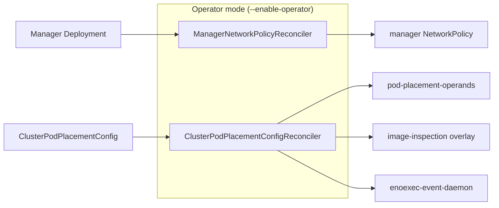

# NetworkPolicy Hardening for MTO Workloads

## Release Signoff Checklist

- [x] Enhancement is `implementable`
- [x] Design details are appropriately documented from clear requirements
- [x] Test plan is defined
- [ ] Graduation criteria for dev preview, tech preview, GA
- [ ] User-facing documentation is created in [openshift-docs](https://github.com/openshift/openshift-docs/)

## Summary

Add additive `networking.k8s.io/v1` NetworkPolicy resources for all Multiarch Tuning Operator
workloads on supported OpenShift deployments, including HyperShift (HCP). The policies are created
at runtime by the operator itself, not shipped as static OLM bundle manifests, so they work across
OCP 4.16-5.x without depending on OLM NetworkPolicy support.

Each MTO-managed workload receives a label-scoped policy that follows established OpenShift
operator conventions for peer encoding: namespace-scoped DNS egress on TCP+UDP 5353,
destination-less API egress on TCP 6443, namespace-scoped metrics ingress on TCP 8443, and
MTO-specific rules for source-unrestricted webhook ingress and image-inspection egress.

## Motivation

HPSTRAT-104 requires OpenShift operators to ship NetworkPolicy coverage for their own workloads.
MTO currently has none. A static YAML in the OLM bundle would fail Enterprise Contract
(`olm.allowed_resource_kinds: NetworkPolicy`) and would not be managed correctly by OLM on
OCP 4.16-4.19. Runtime reconciliation is the approach that satisfies both the hardening mandate
and the older OLM constraint.

### User Stories

- As a cluster administrator, I want the Multiarch Tuning Operator's workloads to be protected by
  NetworkPolicy so that HPSTRAT-104 network hardening requirements are satisfied without manual
  policy authoring.
- As a HyperShift administrator, I want MTO's NetworkPolicies to use destination-less API egress
  and source-unrestricted webhook ingress so that policies do not break on topologies where the
  API server is not represented by guest cluster pods.
- As an operator consumer on OCP 4.16-4.19, I want NetworkPolicy protection without requiring OLM
  bundle support for `NetworkPolicy` manifests, which is not available until the OLM backport lands.

### Goals

- Protect every MTO-managed workload (manager, pod-placement controller, pod-placement webhook,
  ENoExec event handler, ENoExec daemon) with a label-scoped `NetworkPolicy`.
- Follow established OpenShift operator conventions for peer encoding, with MTO-specific rules
  where MTO's network requirements have no common-pattern equivalent:
  - DNS egress: namespace selector `kubernetes.io/metadata.name=openshift-dns`, TCP+UDP 5353.
    MTO uses namespace-only scoping (no pod selector) because the
    `dns.operator.openshift.io/daemonset-dns=default` pod label is not guaranteed on every
    supported OpenShift/HCP DNS topology.
  - API egress: destination-less TCP 6443 (no `to`). The API server is host-networked; its
    address varies by topology.
  - Metrics ingress: TCP 8443 scoped to the `openshift-monitoring` namespace
    (`kubernetes.io/metadata.name=openshift-monitoring`). Only Prometheus in
    `openshift-monitoring` scrapes MTO metrics, so namespace-scoping is least-privilege.
  - Webhook ingress: source-unrestricted TCP 9443 (no `from`). The API server may call the
    webhook from outside the guest pod network on HCP topologies. Matches the manager/webhook
    Service `targetPort`.
  - Registry / image-inspection egress: destination-unrestricted TCP, all ports. MTO-specific;
    registries, CDN endpoints, mirrors, and proxies use arbitrary addresses.
- Create all policies at runtime so the operator works on OCP 4.16+ without depending on OLM
  `NetworkPolicy` bundle support.
- Provide self-healing for the manager policy (recreation on deletion) and lifecycle-bound operand
  policies (created and deleted with the `ClusterPodPlacementConfig` operands).
- Add the `networking.k8s.io/networkpolicies` RBAC permission to a namespace-scoped Role (for
  operator-local resources) and include it in the CSV's `permissions`, so the Enterprise Contract
  `olm.required_network_policy_rbac_for_operands` check passes. Cluster-scoped resources remain
  in the existing ClusterRole.

### Non-Goals

- MTO does not create a namespace-wide or default-deny policy. NetworkPolicy allow rules are
  additive: if any applicable policy allows a flow, another policy cannot deny that flow.
  Administrators can add policies that allow additional traffic, while traffic in an isolated
  direction is blocked unless some applicable policy allows it. MTO's policies isolate only the
  directions declared by their `PolicyTypes` for selected pods, so a separate empty deny-all
  policy for those directions is not required. However, a platform-level default-deny policy is
  expected once all operators comply with HPSTRAT-104. MTO's policies must be complete and
  functional under a default-deny; this is a hard testing requirement (see Test Plan).
- This story does not add ClusterPodPlacementConfig fields for configuring NetworkPolicy peers,
  ports, CIDRs, registries, or proxies. It adds no configurable egress policy; the specified
  NetworkPolicies nevertheless restrict egress for selected pods to the rules they declare. If
  non-OCP support later requires a configurable networking API, design and track that separately
  under or alongside MULTIARCH-5324.
- No registry FQDN/CIDR allow-list. Image inspection contacts arbitrary registries and CDN
  endpoints; destination-less TCP on all ports for the image-inspection workload is intentional.
- No static `NetworkPolicy` manifest in the OLM bundle. The Enterprise Contract
  `olm.allowed_resource_kinds` rule currently blocks this, and pre-4.20 OLM does not manage
  `NetworkPolicy` lifecycle correctly.
- No promise of non-OpenShift support. Generic Kubernetes support is tracked in MULTIARCH-5324.
- No health-probe ingress rule (TCP 8081) is included for supported primary-network deployments:
  kubelet probes originate from the host/node network and are outside NetworkPolicy enforcement.
  OVN-Kubernetes user-defined networks can filter HTTP, TCP, and gRPC kubelet probes when the
  kubelet cgroup match is unavailable; if MTO supports those networks, probe behavior must be
  tested with the documented probe configuration (for example, `exec` probes or the
  `open-default-ports` annotation, as applicable).
- No `policy-group.network.openshift.io/host-network` peer. Nothing in the current MTO workloads
  needs ingress from host-network pods besides kubelet probes, which are outside NetworkPolicy
  enforcement on supported primary networks.
- MTO does not support installing into a namespace where a default-deny policy already selects the
  operator pods. The manager policy is created at runtime by `ManagerNetworkPolicyReconciler`,
  which requires API access to create the policy — a pre-existing default-deny would block that
  API egress, creating a deadlock. The platform is expected to apply namespace-wide default-deny
  only after all operators have created their own policies (per HPSTRAT-104 rollout ordering).
  When MTO migrates the manager policy to a static OLM bundle manifest (see Future Migration
  section), the bundle-delivered policy will exist before the manager pod starts, removing this
  ordering constraint.

## Proposal

Four runtime `NetworkPolicy` objects, one per workload selector. Operand policies are applied by
the existing `ClusterPodPlacementConfigReconciler`. The manager policy is applied by a dedicated
`ManagerNetworkPolicyReconciler` because the manager Deployment exists before any
`ClusterPodPlacementConfig` is created.

### Policy Coverage

#### 1. Pod-placement operands (`pod-placement-operands`)

- **Selector:** `multiarch.openshift.io/operand: pod-placement-controller`
- **PolicyTypes:** Ingress, Egress
- **Ingress:**
  - Metrics: TCP 8443 from `openshift-monitoring` namespace
  - Webhook: source-unrestricted TCP 9443 (HCP-safe; no `from`)
- **Egress:**
  - DNS: to `openshift-dns` namespace (namespace-only), TCP+UDP 5353
  - API: destination-less TCP 6443

This policy covers the pod-placement controller, pod-placement webhook, and ENoExec event handler
Deployments, which share the operand label.

#### 2. Pod-placement image inspection (`pod-placement-controller-image-inspection`)

- **Selector:** `multiarch.openshift.io/operand: pod-placement-controller` AND
  `controller: pod-placement-controller`
- **PolicyTypes:** Egress
- **Egress:** destination-less TCP, all ports (registries, CDN endpoints, mirrors, proxies;
  addresses are dynamic and unknowable at policy-authoring time)

This overlay applies only to the pod-placement controller, which is the only operand that inspects
container images.

#### 3. ENoExec daemon (`enoexec-event-daemon`)

- **Selector:** `app: enoexec-event-daemon`
- **PolicyTypes:** Egress
- **Egress:**
  - DNS: to `openshift-dns` namespace (namespace-only), TCP+UDP 5353
  - API: destination-less TCP 6443

#### 4. Manager (`multiarch-tuning-operator-controller-manager`)

- **Selector:** `control-plane: controller-manager`
- **PolicyTypes:** Ingress, Egress
- **Ingress:**
  - Metrics: TCP 8443 from `openshift-monitoring` namespace
  - Webhook: source-unrestricted TCP 9443 (no `from`)
- **Egress:**
  - DNS: to `openshift-dns` namespace (namespace-only), TCP+UDP 5353
  - API: destination-less TCP 6443

### Architecture

#### Operand policies (1-3)

Created by the existing `ClusterPodPlacementConfigReconciler` alongside other operand resources
(Deployments, DaemonSets, Services, RBAC). Policies are added to the desired-objects list and
applied via `utils.ApplyResources()`, which has a `*networkingv1.NetworkPolicy` case using
`resourceapply.ApplyNetworkPolicy` from library-go.

Self-healing is provided by `Owns(&networkingv1.NetworkPolicy{})` in the controller's
`SetupWithManager`. Cleanup uses the existing operand deletion lists, which include
`NetworkPolicy` entries.

#### Manager policy (4)

Created by a dedicated `ManagerNetworkPolicyReconciler` that:

1. Watches the manager `Deployment` (filtered by name and namespace predicate).
2. Owns the manager `NetworkPolicy`.
3. Uses `controllerutil.CreateOrUpdate` with `ctrl.SetControllerReference` to set the Deployment
   as the policy's controller owner.
4. Recreates the policy if deleted (via `Owns()`).
5. Garbage-collects the policy when the Deployment is removed.

The manager policy cannot live on the CPPC reconciler because the manager Deployment exists
before any `ClusterPodPlacementConfig` is created.

#### Cache scoping

The NetworkPolicy Role is namespace-scoped, so the NetworkPolicy informer must be scoped to
the operator namespace. Without this, controller-runtime creates a cluster-wide informer that
the namespace-scoped Role cannot authorize, causing `Forbidden` errors on list/watch requests.

`cmd/main.go` adds a `cache.ByObject` entry for `NetworkPolicy` scoped to `utils.Namespace()`
in the `enableOperator` block. All other types (Deployments, Services, etc.) remain on their
existing ClusterRole and use cluster-wide informers as before.



### Peer Encoding Rationale

Peer encoding follows established OpenShift operator conventions where applicable. DNS and
metrics use tighter scoping for topology compatibility and least-privilege respectively.
Webhook and image-inspection rules are MTO-specific.

| Flow | Encoding | Rationale |
|------|----------|-----------|
| DNS egress | Namespace `kubernetes.io/metadata.name=openshift-dns`, TCP+UDP 5353 (namespace-only, no pod selector) | OpenShift CoreDNS listens on 5353 (not 53). MTO uses namespace-only scoping (no pod selector) because the `dns.operator.openshift.io/daemonset-dns=default` label is not guaranteed on every supported OpenShift/HCP DNS topology. The `openshift-dns` namespace is purpose-built and contains only DNS workloads, so namespace-only scoping is sufficient. |
| API egress | Destination-less TCP 6443 (no `to`) | The API server is host-networked; its address varies by topology. On HCP it is not a guest-cluster pod. Follows established OpenShift operator convention. Kubernetes `hostNetwork` / Service-NAT vs NetworkPolicy ordering is CNI-dependent, so destination-less is a compatibility choice, not a guarantee on every CNI. |
| Metrics ingress | TCP 8443 from namespace `kubernetes.io/metadata.name=openshift-monitoring` | Only Prometheus in `openshift-monitoring` scrapes MTO metrics, so namespace-scoping is least-privilege. Some operators use source-unrestricted (no `from`) port-only rules; MTO restricts the source because it can identify the sole consumer. MTO exposes only 8443. |
| Webhook ingress | Source-unrestricted TCP 9443 (no `from`) | MTO-specific. Same HCP / host-network reasoning as API egress: the API server may call the webhook from outside the guest pod network. MTO Service `targetPort` is 9443. |
| Health probes | Not included | On the primary pod network, kubelet probes originate from the host/node and are outside NetworkPolicy enforcement. OVN-Kubernetes user-defined networks can filter HTTP, TCP, and gRPC probes when the kubelet cgroup match is unavailable; if those networks are supported, test probes with the documented configuration (for example, `exec` probes or the `open-default-ports` annotation, as applicable). |
| Image inspection | Destination-unrestricted TCP, all ports (no `to`, no port) | MTO-specific. Registries, CDN endpoints, mirrors, and proxies use arbitrary addresses and ports. Standard NetworkPolicy cannot express an FQDN allow-list. |

## Design Details

### Changes to the Operator

#### New files

- `internal/controller/operator/networkpolicy.go`: policy builders and shared helpers (DNS, API,
  metrics, webhook, image-inspection rules)
- `internal/controller/operator/manager_networkpolicy_controller.go`: `ManagerNetworkPolicyReconciler`
- `internal/controller/operator/networkpolicy_test.go`: unit tests for all policy builders
- `internal/controller/operator/manager_networkpolicy_controller_test.go`: envtest for the manager
  policy reconciler
- `config/rbac/networkpolicy_role.yaml`: namespace-scoped Role for NetworkPolicy permissions
- `config/rbac/networkpolicy_rolebinding.yaml`: RoleBinding for the NetworkPolicy Role
- `pkg/testing/framework/networkpolicy.go`: test framework helpers
- `pkg/testing/builder/networkpolicy.go`: test builder helpers

#### Modified files

- `internal/controller/operator/clusterpodplacementconfig_controller.go`: operand policies on
  the desired-objects and delete-ref lists, `Owns(&networkingv1.NetworkPolicy{})`
- `cmd/main.go`: register `ManagerNetworkPolicyReconciler` in `RunOperator()`, add
  NetworkPolicy `cache.ByObject` entry scoped to the operator namespace
- `pkg/utils/const.go`: policy name constants, DNS/monitoring namespace constants
- `pkg/utils/resource.go`: `*networkingv1.NetworkPolicy` case in `ApplyResource()`
- `config/rbac/kustomization.yaml`: includes the new Role and RoleBinding
- `bundle/manifests/*.clusterserviceversion.yaml`: regenerated CSV with `networking.k8s.io`
  RBAC in `permissions` (namespace-scoped)

### RBAC Changes

The existing ClusterRole (`config/rbac/role.yaml`) is unchanged. A dedicated namespace-scoped
Role is added for NetworkPolicy permissions only, following the same pattern as
`leader-election-role` and `read-configmaps-role`:

**New Role** (`config/rbac/networkpolicy_role.yaml`, `kind: Role`, `namespace: system`):

```yaml
- apiGroups:
    - networking.k8s.io
  resources:
    - networkpolicies
  verbs:
    - create
    - delete
    - get
    - list
    - patch
    - update
    - watch
```

**New RoleBinding** (`config/rbac/networkpolicy_rolebinding.yaml`) binds the Role to the
controller-manager ServiceAccount in the operator namespace.

The Role and RoleBinding are hand-maintained YAML files included in
`config/rbac/kustomization.yaml`, following the same pattern as `leader_election_role.yaml`.
No kubebuilder `namespace=system` marker is used — this is consistent with the project's
convention for namespace-scoped Roles. `make manifests` regenerates only the ClusterRole
from markers; the NetworkPolicy Role is not affected.

The generated CSV includes `networking.k8s.io` permissions in the `permissions` section
(namespace-scoped), not in `clusterPermissions`.

Because the NetworkPolicy Role is namespace-scoped, the NetworkPolicy informer must be scoped
to the operator namespace in `cache.ByObject`. Without this, controller-runtime creates a
cluster-wide informer that the Role cannot authorize. See the Cache Scoping section above.

### Risks and Mitigations

| Risk | Mitigation |
|------|------------|
| Additive policies with `PolicyTypes: [Ingress, Egress]` create implicit deny for unmatched traffic on selected pods | Document that the policies are additive but do impose egress restrictions. Ensure all required egress paths (DNS, API, registry) are explicitly allowed. |
| DNS peer matches no namespace | The DNS peer uses only the `kubernetes.io/metadata.name=openshift-dns` namespace selector. It matches nothing if the `openshift-dns` namespace is absent or does not match that selector; a DNS pod label is not part of the peer. Validate DNS egress on standalone OpenShift and HCP in e2e. |
| Proxy-aware image inspection may use non-443 ports (3128, 8080) | The image-inspection policy uses destination-less TCP on all ports, not just 443. |
| envtest garbage collection does not run kube-controller-manager | Explicitly delete both the manager Deployment and NetworkPolicy in AfterEach; wait for both to be confirmed absent. |
| `IsResourceAvailable` caches transient errors as permanent resource absence | Pre-existing bug on `main` tracked in [MULTIARCH-6361](https://redhat.atlassian.net/browse/MULTIARCH-6361). Monitoring CRD discovery at startup can permanently skip ServiceMonitor/PrometheusRule if the API is temporarily unreachable. |

### Drawbacks

- Runtime creation adds a dedicated controller registration compared to a static bundle manifest.
- The manager policy reconciler is a permanent fixture until OLM NetworkPolicy support is
  backported and the EC rule is lifted, at which point the operator could migrate to a static
  bundle manifest.

### Test Plan

#### Unit tests

- Assert exact selectors, port numbers, protocols, peer shapes for DNS
  (namespace-only `openshift-dns`, TCP+UDP 5353), API (destination-less TCP 6443), and
  metrics (TCP 8443 from `openshift-monitoring` namespace); plus source-unrestricted
  webhook ingress on TCP 9443; and `PolicyTypes` for each of the four policy builders.
- Assert no `IPBlock` rules (no hardcoded CIDRs).
- Assert image-inspection egress is only on the image-inspection policy.
- Assert health-probe ingress (TCP 8081) is not listed.
- Assert `config/default/kustomization.yaml` does not include `../network` (no static bundle
  NetworkPolicy).

#### Integration tests (envtest)

- Manager policy: create Deployment → verify NetworkPolicy is created; delete NetworkPolicy →
  verify it is recreated.
- Operand policies: create CPPC → verify operand NetworkPolicies are created; delete CPPC →
  verify operand NetworkPolicies are deleted.

#### Functional / E2E tests

- On supported primary-network standalone OpenShift and HCP clusters, verify DNS resolution, API
  access, webhook admission, metrics scraping, health probes, and image inspection remain
  functional with all policies installed. If OVN-Kubernetes user-defined networks are supported,
  test health probes with their documented probe configuration (for example, `exec` probes or the
  `open-default-ports` annotation, as applicable).
- **Default-deny validation (required):** Deploy a namespace-wide default-deny policy
  (`podSelector: {}`, `PolicyTypes: [Ingress, Egress]`, no rules) in the MTO namespace, then
  verify all MTO functionality remains operational on supported primary-network clusters: DNS
  resolution, API access, webhook admission, metrics scraping, health probes, and image inspection.
  If OVN-Kubernetes user-defined networks are supported, test health probes with their documented
  probe configuration. This validates that every required pod-network flow has an explicit allow
  rule; host/node traffic, including kubelet probes on the primary network, is outside the
  NetworkPolicy guarantee. This test is mandatory because a platform-level default-deny is expected
  once all operators comply with HPSTRAT-104.

### Graduation Criteria

This enhancement ships as part of MULTIARCH-5569. No alpha/beta graduation is needed.

Applying a NetworkPolicy with `PolicyTypes: [Ingress, Egress]` creates an implicit deny for
unmatched traffic on the selected pods. This means the policies **do** restrict the network
posture of MTO workloads as soon as they are created — only the explicitly listed pod-network
flows (DNS, API, metrics, webhook, image-inspection) are allowed. Host/node traffic, including
kubelet probes, is outside this NetworkPolicy guarantee. This is the intended hardening behavior.
All required egress and ingress paths are enumerated in the policy builders; the E2E default-deny
test validates that no unlisted pod-network dependency exists.

### Upgrade / Downgrade Strategy

#### Upgrade

- New policies are created on first reconciliation after upgrade.
- If a pre-existing CSV-owned NetworkPolicy exists from an earlier static-bundle approach, the
  manager reconciler detects the ownership conflict (different controller owner UID), deletes the
  stale policy, and recreates it with Deployment ownership.

#### Downgrade

- Operand policies are deleted when the CPPC is deleted (standard operand lifecycle).
- The manager policy is garbage-collected when the manager Deployment is removed by OLM during
  uninstall.
- If the operator is downgraded to a version without NetworkPolicy support, the policies become
  orphaned (no matching controller). They are harmless because they select pods by labels that the
  downgraded operator still uses. Administrators can delete them manually if needed.

### Operational Aspects of API Extensions

This enhancement does not introduce API extensions. No CRD changes, no new
`ClusterPodPlacementConfig` fields.

#### Failure Modes

NetworkPolicy creation failure does not block operator functionality. NetworkPolicy is additive
security hardening, not a functional requirement for pod placement. Operand NetworkPolicies are
applied through the same `utils.ApplyResources()` batch as Deployments, Services, and RBAC.
Because functional resources precede NetworkPolicies in the objects list, a NetworkPolicy apply
failure occurs after the functional resources are already created. The aggregated error causes
the reconciler to requeue (retrying all resources including the failed NetworkPolicy), but the
operator is functional. No dedicated CPPC status condition tracks NetworkPolicy state — the
failure is surfaced through reconciler logs and retry behavior. The operator continues normal
operation (pod gating, image inspection, webhook admission) regardless of whether policies
exist.

Specific failure scenarios:

- If the operator lacks `networking.k8s.io` RBAC, policy creation fails. The reconciler logs
  the error and retries on subsequent reconciliation cycles.
- If a transient API server error prevents policy creation or update, the reconciler requeues
  and retries.
- If the `openshift-dns` namespace is absent or does not match the DNS peer's
  `kubernetes.io/metadata.name=openshift-dns` namespace selector (for example, on a non-OpenShift
  cluster), the policies are still created but the DNS peer matches nothing. DNS pod labels do not
  affect this namespace-only peer. This is a no-op for that rule, not a creation failure. Metrics
  and API rules do not depend on that namespace.

## Documentation Plan

- Document the four policies, their selectors, and the peer-encoding rationale in the operator's
  user-facing documentation.
- Document that the policies are additive and do not implement a namespace-wide default-deny.
- Document the intentional open TCP egress for image inspection and the proxy-as-tightening-path
  option.
- Document that non-OpenShift support is out of scope (MULTIARCH-5324).

## Implementation History

- 2026-09-22: PR #558: initial implementation with a static bundle manifest and runtime operand
  policies. EC violations identified.
- 2026-09-23: PR #560: runtime reconciliation for all policies (no static bundle manifest).
  Addresses EC `olm.allowed_resource_kinds` violation.
- 2026-09-23: This enhancement document.

## Alternatives

### Static NetworkPolicy in the OLM bundle with an EC exception

Ship the manager `NetworkPolicy` as a YAML manifest in `bundle/manifests/` and request an
Enterprise Contract exception for `olm.allowed_resource_kinds`.

*Rejected because:* OLM on OCP 4.16-4.19 does not properly support `NetworkPolicy` as a bundle
manifest kind. The EC rule exists to protect those versions. VPA and CRO operators obtained
exceptions starting at 4.21 only.

### Startup-time CreateOrUpdate (no controller)

Create the manager `NetworkPolicy` once in `main.go` at operator startup using
`controllerutil.CreateOrUpdate`, with no reconciler or watches.

*Considered as a simpler alternative.* Repairs drift on pod restart but does not self-heal if the
policy is deleted while the operator is running. The full reconciler provides stronger guarantees.

### ClusterPodPlacementConfig networking configuration API

Add DNS, API, registry, proxy, and CIDR peer fields to `ClusterPodPlacementConfig` for a generic,
configurable policy model.

*Rejected because:* this overbuilds MULTIARCH-5569, which is an OpenShift security hardening
story. Image inspection cannot be expressed as a static registry allow-list. A generic
configuration API belongs in MULTIARCH-5324.

### ClusterIP / EndpointSlice discovery

Discover the `kubernetes.default` Service ClusterIP and DNS endpoint IPs at reconcile time, then
emit `ipBlock` rules.

*Rejected because:* the API server is host-networked; Service NAT vs NetworkPolicy ordering is
CNI-dependent. Established OpenShift operators use destination-less TCP 6443 rather than
ClusterIP-as-peer for this reason. Destination-less port rules are the safer convention.
## Future Migration to OLM-Managed NetworkPolicies

### Context

The runtime reconciliation approach in this enhancement is necessary because
OLM does not support NetworkPolicy manifests in bundles on OCP < 4.20, and the
Conforma policy KONFLUX-9372 currently blocks NetworkPolicy in bundles across
all OCP versions as an interim measure. The OLM team is backporting
NetworkPolicy support to OCP 4.12 for OLMv0 and OCP 4.18 for OLMv1 (tracked
in OPRUN-4069).

### Migration trigger

MTO should migrate the manager NetworkPolicy from runtime reconciliation to a
static OLM bundle manifest when EITHER of the following conditions is met:

1. The OLM backport lands on all OCP versions that MTO actively supports AND
   the Conforma interim block (KONFLUX-9372) is lifted, OR
2. MTO drops support for OCP <= 4.19 from its active release branches.

### Migration plan

When the trigger condition is met:

1. Add the manager NetworkPolicy YAML to `config/network/` and include
   `- ../network` in `config/default/kustomization.yaml` (restoring the
   structure from the original PR #558 design).
2. Remove the `ManagerNetworkPolicyReconciler` controller, its registration
   in `RunOperator()`, and its envtest.
3. Add a migration check in the CPPC reconciler or a startup hook to detect
   and delete any runtime-owned manager NetworkPolicy left over from the
   previous approach, so OLM can take ownership cleanly.
4. Regenerate the bundle (`make manifests generate bundle`) and verify the
   NetworkPolicy appears in `bundle/manifests/`.
5. Verify the Conforma `olm.allowed_resource_kinds` check passes without an
   exception.

The operand NetworkPolicies (pod-placement, image-inspection, ENoExec daemon)
remain runtime-managed regardless of this migration, because the OLM guidance
states: "NetworkPolicies included in OLM bundles should only be used for the
operators installed by OLM. If NetworkPolicies are needed for operands, the
operators should manage these NetworkPolicies as OLM will not manage them."

### Tracking

This migration is not part of MULTIARCH-5569. File a follow-up story when the
trigger condition is met, linking to HPSTRAT-278 and OPRUN-4069.
## Infrastructure Needed

None. No new CI clusters, CRDs, or external services.

## References

- [MULTIARCH-5569](https://issues.redhat.com/browse/MULTIARCH-5569): parent story
- [HPSTRAT-104](https://issues.redhat.com/browse/HPSTRAT-104): network hardening dependency
- [HPSTRAT-278](https://issues.redhat.com/browse/HPSTRAT-278): NetworkPolicy in OLM bundles
  mandate (Feb 2027)
- [MULTIARCH-5324](https://issues.redhat.com/browse/MULTIARCH-5324): generic non-OpenShift
  support epic
